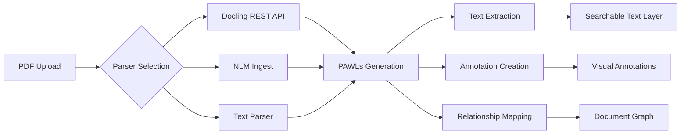

# PDF Data Processing Architecture

## Overview

OpenContracts uses a modern, pluggable document processing pipeline that has evolved from the original PAWLs/Grobid approach to support multiple advanced parsing backends. The system now leverages state-of-the-art machine learning models while maintaining backward compatibility with the PAWLs data format.

## Current Architecture

### Parser Pipeline System

OpenContracts implements a modular pipeline architecture with three main parser options:

1. **Docling Parser (Primary)** - IBM's advanced ML-based parser running as a REST microservice
   - Superior layout understanding and table extraction
   - Intelligent OCR with automatic detection
   - Hierarchical document structure extraction
   - Group relationship detection for contract clauses

2. **NLM Ingest Parser** - Alternative parser using NLM Ingest library
   - Faster processing for standard PDFs
   - Good layout analysis without ML overhead
   - Suitable for documents not requiring OCR

3. **Text Parser** - Simple parser for plain text and markdown files
   - Direct text extraction
   - Minimal processing overhead
   - Preserves original formatting

### Data Layers

OpenContracts maintains a multi-layered data architecture that provides a consistent interface regardless of the parsing backend used:

#### 1. PAWLs Layer (JSON)
The PAWLs (PDF Annotation With Labels) layer remains the core data format, storing:
- Individual tokens (words) with precise bounding box coordinates
- Page dimensions and layout information
- Token-level positional data enabling pixel-perfect annotation overlay
- Hierarchical structure information (headers, paragraphs, lists)

```json
{
  "pawls_file_content": [
    {
      "page": {"width": 612, "height": 792, "index": 0},
      "tokens": [
        {
          "text": "Contract",
          "bbox": {"x": 100, "y": 50, "width": 80, "height": 15}
        }
      ]
    }
  ]
}
```

#### 2. Text Layer
A pure text extraction built from the PAWLs layer that:
- Preserves reading order
- Maintains paragraph and section boundaries
- Enables full-text search and NLP processing
- Provides character-level position mapping back to PAWLs tokens

#### 3. Annotation Layer
Structural and semantic annotations including:
- Document structure (headers, sections, paragraphs)
- Detected entities and labels
- User-created annotations
- Relationships between document elements

#### 4. Relationship Layer (New)
Advanced parsers like Docling can detect relationships between document elements:
- Parent-child hierarchies (section → subsection)
- Cross-references between clauses
- Grouped elements (related paragraphs, list items)
- Table cell relationships

## Processing Pipeline



## Evolution from Original PAWLs

The original OpenContracts implementation used:
- **Grobid** for layout analysis
- **Tesseract** for OCR
- Re-OCR of every document for consistency

The current system has evolved to:
- Use modern ML models for better accuracy
- Support multiple parsing backends
- Preserve embedded text when appropriate
- Only apply OCR when needed (configurable)
- Extract richer structural information

### Key Improvements

1. **Better Accuracy**: ML-based parsers provide superior layout understanding
2. **Flexibility**: Choose the right parser for your document types
3. **Performance**: Microservice architecture enables better scaling
4. **Rich Structure**: Extract hierarchies and relationships, not just text
5. **Selective OCR**: Only OCR when needed, preserving original text quality

## Maintaining Compatibility

Despite the architectural evolution, OpenContracts maintains full compatibility:
- PAWLs format remains the standard interface
- All parsers output to the same data structure
- Existing annotations and tools continue to work
- Text-to-position mapping preserved

## Configuration

Parsers are configured in Django settings:

```python
PREFERRED_PARSERS = {
    "application/pdf": "opencontractserver.pipeline.parsers.docling_parser_rest.DoclingParser",
    "text/plain": "opencontractserver.pipeline.parsers.oc_text_parser.TxtParser",
}

# Parser-specific settings
DOCLING_PARSER_SERVICE_URL = "http://docling-parser:8000/parse/"
DOCLING_PARSER_TIMEOUT = 300
```

## Limitations and Trade-offs

### Current Limitations
1. **OCR Quality**: While improved, OCR can still make errors (O vs 0, I vs 1)
2. **Processing Time**: ML-based parsers are slower than simple text extraction
3. **Resource Usage**: Advanced parsers require more memory and CPU
4. **Format Support**: Currently limited to PDF and text formats

### Design Trade-offs
1. **Accuracy vs Speed**: ML parsers are more accurate but slower
2. **Flexibility vs Complexity**: Multiple parsers add configuration complexity
3. **Consistency vs Fidelity**: Standardizing to PAWLs format may lose some format-specific features

## Future Directions

1. **Additional Format Support**: DOCX, XLSX, HTML parsing
2. **Streaming Processing**: Handle very large documents efficiently
3. **Custom Parser Plugins**: Easy integration of domain-specific parsers
4. **Enhanced Relationships**: More sophisticated document graph analysis
5. **Hybrid Processing**: Combine multiple parsers for optimal results

## See Also

- [Pipeline Overview](../pipelines/pipeline_overview.md)
- [Docling Parser Documentation](../pipelines/docling_parser.md)
- [NLM Ingest Parser Documentation](../pipelines/nlm_ingest_parser.md)
- [Original PAWLs Project](https://github.com/allenai/pawls)
