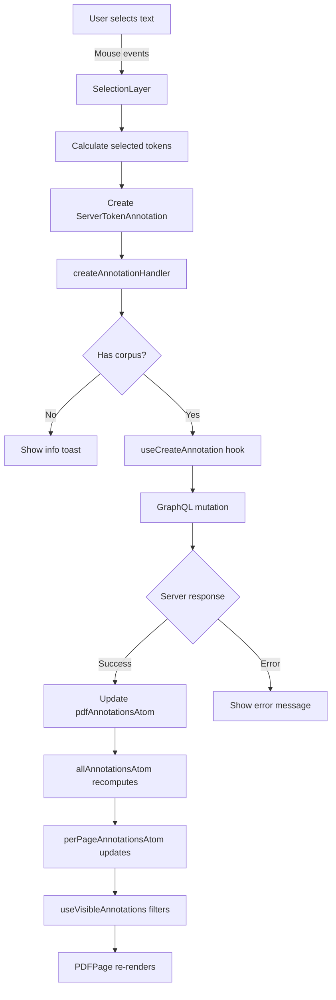

# How Annotations are Created and Handled

## Overview

The annotation creation and handling system has evolved to use modern React patterns with Jotai atoms for state management and hooks for encapsulation. Here's how the current system works:

## Annotation Creation Flow

### 1. User Selection
- User selects text on the PDF by clicking and dragging
- This triggers mouse events in the `SelectionLayer` component within `PDFPage`
- The selection layer handles both single-page and multi-page selections

### 2. Selection Handling
The `SelectionLayer` component:
- Detects mouse down/move/up events
- Calculates the selected tokens based on coordinates
- Checks if Shift key is pressed for multi-page selections
- Creates a `ServerTokenAnnotation` object with the selection data

### 3. Annotation Creation
```typescript
// In PDFPage.tsx
const createAnnotationHandler = async (annotation: ServerTokenAnnotation) => {
  if (!corpusId) {
    toast.info("Add document to corpus to create annotations");
    return;
  }
  return originalCreateAnnotationHandler(annotation);
};
```

The `useCreateAnnotation` hook (from AnnotationHooks.tsx):
- Sends a GraphQL mutation to create the annotation
- Updates local state optimistically
- Handles success/error responses
- Updates the `pdfAnnotationsAtom` with the new annotation

### 4. State Updates
When an annotation is created:
1. GraphQL mutation is sent to the backend
2. On success, the annotation is added to `pdfAnnotationsAtom`
3. `allAnnotationsAtom` automatically recomputes (includes new annotation)
4. `perPageAnnotationsAtom` automatically updates with page indexing
5. `useVisibleAnnotations` includes the new annotation based on filters
6. Affected `PDFPage` components re-render with the new annotation

## Annotation Data Flow



## Annotation Storage Architecture

### Separation of Concerns
Annotations are stored in separate atoms based on their type:

1. **Regular Annotations** (`pdfAnnotationsAtom`)
   - User-created annotations
   - System-generated annotations
   - Stored as `PdfAnnotations` class instance

2. **Structural Annotations** (`structuralAnnotationsAtom`)
   - Document structure markers (sections, paragraphs, etc.)
   - Kept separate to prevent duplication
   - Hidden by default for better UX

3. **Combined View** (`allAnnotationsAtom`)
   - Computed atom that merges both arrays
   - Deduplicates by annotation ID
   - Single source for all annotations

### Annotation Class Structure

```typescript
export class ServerTokenAnnotation {
  constructor(
    public readonly page: number,
    public readonly annotationLabel: AnnotationLabelType,
    public readonly rawText: string,
    public readonly structural: boolean,  // Key property for filtering
    public readonly json: MultipageAnnotationJson,
    public readonly myPermissions: PermissionTypes[],
    public readonly approved: boolean,
    public readonly rejected: boolean,
    public readonly canComment: boolean = false,
    id: string | undefined = undefined
  ) {
    this.id = id || uuidv4();
  }
}
```

## Annotation Visibility Management

### The `useVisibleAnnotations` Hook
This is the single source of truth for which annotations should be displayed:

```typescript
export function useVisibleAnnotations() {
  // Get all annotations (regular + structural)
  const allAnnotations = useAllAnnotations();

  // Get UI settings
  const { showStructural, showStructuralRelationships } = useAnnotationDisplay();
  const { spanLabelsToView } = useAnnotationControls();
  const { selectedAnnotations, selectedRelations } = useAnnotationSelection();

  return useMemo(() => {
    // Determine forced visibility (selected items)
    const forcedIds = new Set(selectedAnnotations);

    // Apply filtering logic
    return allAnnotations.filter((annot) => {
      // Always show forced/selected
      if (forcedIds.has(annot.id)) return true;

      // Structural filter
      if (annot.structural) {
        return showStructural; // Only show if toggle is ON
      }

      // Label filter
      if (labelFilter && !labelFilter.has(annot.annotationLabel.id)) {
        return false;
      }

      return true; // Show all other annotations
    });
  }, [/* dependencies */]);
}
```

### Filtering Hierarchy
1. **Forced Visibility**: Selected annotations always shown
2. **Structural Filter**: Hide/show based on `showStructuralAnnotationsAtom`
3. **Label Filter**: Filter by annotation labels
4. **Page Filter**: PDFPage components filter by page number

## Annotation Controls

### Control Components
The annotation visibility is controlled through two synchronized components:

1. **FloatingDocumentControls**
   - Shows when right panel is closed
   - Provides settings button that expands to show `AnnotationControls`
   - Visibility controlled by `showRightPanel` prop

2. **SidebarControlBar**
   - Shows in right panel when in feed mode
   - Includes `AnnotationControls` inline
   - Shows when annotations are selected in content filters

Both use the same `AnnotationControls` component which provides:
- Show/Hide Structural toggle
- Show Selected Only toggle
- Show Bounding Boxes toggle
- Label Display mode (Always/On Hover/Hide)
- Label Filters (multi-select)

### Special Behaviors

#### Auto-Enable "Show Selected Only"
When enabling structural annotations:
```typescript
const handleShowStructuralChange = useCallback(() => {
  const newStructuralValue = !showStructural;
  setShowStructural(newStructuralValue);

  // Force "show selected only" when enabling structural view
  if (newStructuralValue) {
    setShowSelectedOnly(true);
  }
}, [showStructural, setShowStructural, setShowSelectedOnly]);
```

This prevents UI overload from showing all structural annotations at once.

## Performance Optimizations

1. **Atom-based Updates**: Only components that use affected atoms re-render
2. **Computed Atoms**: Automatic memoization of derived state
3. **Page-level Filtering**: Each PDFPage only processes its own annotations
4. **Virtualized Rendering**: Only visible pages render annotations
5. **Deduplication**: `allAnnotationsAtom` prevents duplicate processing

## Best Practices

1. **Use Hooks**: Always use provided hooks (`useVisibleAnnotations`, `usePdfAnnotations`, etc.)
2. **Maintain Separation**: Keep structural and regular annotations separate
3. **Centralized Filtering**: All visibility logic goes through `useVisibleAnnotations`
4. **Immutable Updates**: Create new objects when updating atoms
5. **Respect Corpus Context**: Annotations require corpus association
