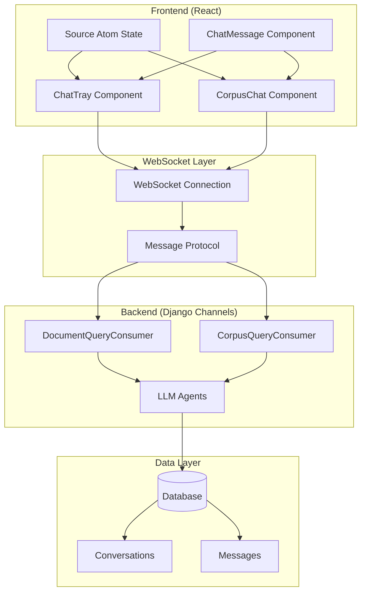
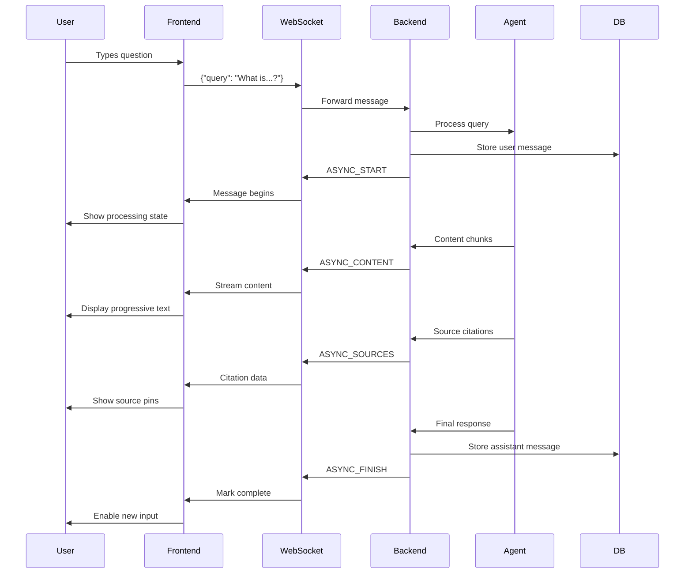

# WebSocket Architecture Documentation

Welcome to the OpenContracts WebSocket architecture documentation! This directory contains comprehensive documentation for the real-time chat system that powers document and corpus conversations.

## 🌟 Overview

OpenContracts uses WebSocket technology to provide real-time, streaming conversations with AI agents. The system enables users to ask questions about documents and corpuses, receiving answers that stream progressively with source citations, reasoning timelines, and tool approval workflows.

## 📁 Documentation Structure

### 🔗 [Protocol Overview](./protocol.md)
**Essential reading for understanding the WebSocket communication protocol**

- Message types and data structures
- Connection lifecycle and authentication
- State management patterns
- Error handling strategies
- Security considerations
- Performance characteristics

### 🖥️ [Backend Implementation](./backend.md)
**Deep dive into the Django Channels WebSocket consumers**

- `DocumentQueryConsumer`: Document-specific conversations
- `CorpusQueryConsumer`: Corpus-wide conversations  
- Agent integration and lifecycle management
- Event processing and streaming
- Approval workflow implementation
- Error handling and logging
- Performance optimizations

### 🎨 [Frontend Implementation](./frontend.md)
**Comprehensive guide to the React WebSocket components**

- `ChatTray`: Document sidebar chat interface
- `CorpusChat`: Full-screen corpus conversations
- State management with React hooks and Jotai
- Message processing and UI updates
- Source citation integration
- Mobile responsiveness
- Testing strategies

## 🚀 Quick Start

### For Backend Developers

1. Read the [Protocol Overview](./protocol.md) to understand message flow
2. Study the [Backend Implementation](./backend.md) for consumer details
3. Key files to examine:
   - `config/websocket/consumers/document_conversation.py`
   - `config/websocket/consumers/corpus_conversation.py`
   - `opencontractserver/llms/agents/`

### For Frontend Developers

1. Start with the [Protocol Overview](./protocol.md) for context
2. Dive into the [Frontend Implementation](./frontend.md) for component details
3. Key files to examine:
   - `frontend/src/components/knowledge_base/document/right_tray/ChatTray.tsx`
   - `frontend/src/components/corpuses/CorpusChat.tsx`
   - `frontend/src/components/widgets/chat/ChatMessage.tsx`

### For Product/QA Teams

1. The [Protocol Overview](./protocol.md) provides the best high-level understanding
2. Focus on the "Message Types" and "Connection Lifecycle" sections
3. Use the error handling sections for troubleshooting guidance

## 🏗️ System Architecture



## 🔄 Message Flow Example

Here's a typical conversation flow:



## 🎯 Key Features

### Real-Time Streaming
- Progressive content display as the AI generates responses
- No waiting for complete responses
- Immediate visual feedback

### Source Citations
- Live source references during streaming
- Clickable annotations that highlight document sections
- Integration with document viewer

### Tool Approval Workflow
- User authorization for sensitive operations
- Modal dialogs for approval decisions
- Graceful handling of approvals/rejections

### Conversation Persistence
- Automatic saving of conversation history
- Resume functionality for long conversations
- Cross-session conversation access

### Mobile Responsiveness
- Adaptive layouts for mobile devices
- Touch-friendly interfaces
- Optimized performance on mobile networks

## 🛠️ Development Workflow

### Adding New Message Types

1. **Backend**: Add new event type to `opencontractserver/llms/agents/core_agents.py`
2. **Consumer**: Handle new event in both consumers' message processing
3. **Frontend**: Add case to message processing switch statements
4. **Types**: Update TypeScript interfaces in frontend
5. **Documentation**: Update this documentation

### Debugging Tips

1. **Use Session IDs**: All backend logs include session IDs for correlation
2. **Browser DevTools**: Monitor WebSocket frames in Network tab
3. **Console Logging**: Frontend logs all WebSocket events
4. **Database Queries**: Check conversation and message records for persistence issues

### Testing Strategies

1. **Unit Tests**: Test individual message processing functions
2. **Integration Tests**: Use Django Channels testing for full flow
3. **E2E Tests**: Browser automation for complete user workflows
4. **Manual Testing**: Use browser DevTools to simulate edge cases

## 🔍 Troubleshooting

### Common Issues

**Connection Failures**
- Check authentication status
- Verify corpus/document permissions
- Review Django Channels configuration

**Message Processing Errors**
- Validate JSON message format
- Check message type spelling
- Review browser console for errors

**Performance Issues**
- Monitor WebSocket frame sizes
- Check for memory leaks in long conversations
- Review database query performance

**UI State Issues**
- Verify state synchronization between server and client
- Check message deduplication logic
- Review React component lifecycle

### Debug Commands

```bash
# Check WebSocket connections
docker logs opencontracts_django_1 | grep "Session"

# Monitor database conversations
docker exec -it opencontracts_postgres_1 psql -U postgres -d opencontracts -c "SELECT * FROM conversations_conversation ORDER BY created_at DESC LIMIT 10;"

# View WebSocket routing
docker exec -it opencontracts_django_1 python manage.py shell -c "from config.routing import websocket_urlpatterns; print(websocket_urlpatterns)"
```

## 📚 Additional Resources

- [Django Channels Documentation](https://channels.readthedocs.io/)
- [WebSocket API Reference](https://developer.mozilla.org/en-US/docs/Web/API/WebSocket)
- [React Hooks Guide](https://reactjs.org/docs/hooks-intro.html)
- [Framer Motion Documentation](https://www.framer.com/motion/)

## 🤝 Contributing

When contributing to the WebSocket system:

1. **Read all documentation** in this directory first
2. **Follow established patterns** for message handling
3. **Add appropriate logging** with session IDs
4. **Update documentation** for any protocol changes
5. **Test thoroughly** across both components
6. **Consider mobile UX** for all UI changes

## 📄 Related Documentation

- [Main Architecture Documentation](../README.md)
- [LLM Agent Architecture](../llm-agents.md)
- [Database Schema](../database.md)
- [API Documentation](../api.md)

---

*This documentation is maintained by the OpenContracts development team. For questions or improvements, please create an issue or submit a pull request.*