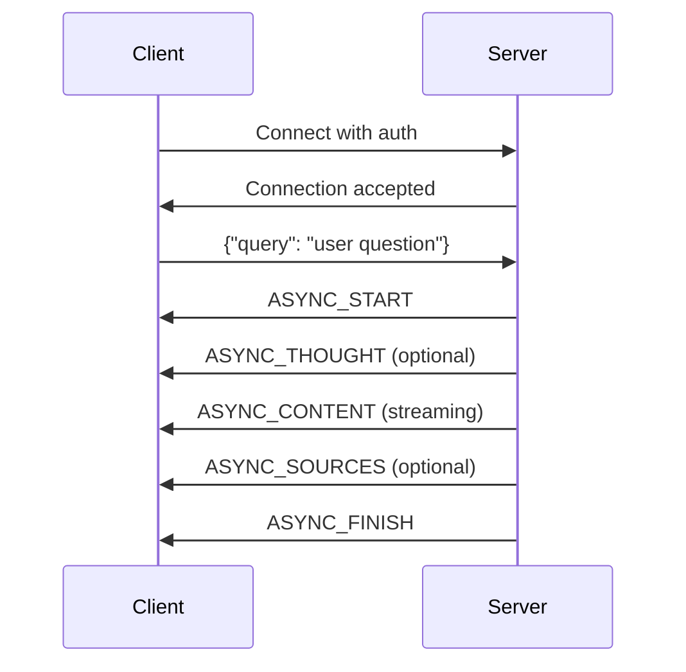

# WebSocket Protocol Overview

## Introduction

OpenContracts uses WebSocket connections to enable real-time streaming communication between the frontend and backend for chat-based interactions. This document provides a comprehensive overview of the WebSocket protocol, message types, and data flow.

## Protocol Architecture

The WebSocket protocol in OpenContracts follows a streaming pattern where:

1. **Client initiates connection** with authentication and context
2. **Client sends queries** as JSON messages
3. **Server streams responses** using typed message events
4. **Client updates UI** reactively based on message type

## Message Types

All WebSocket messages follow a standardized JSON envelope:

```typescript
interface MessageData {
  type: MessageType;
  content: string;
  data?: {
    sources?: WebSocketSources[];
    timeline?: TimelineEntry[];
    message_id?: string;
    tool_name?: string;
    args?: any;
    pending_tool_call?: {
      name: string;
      arguments: any;
      tool_call_id?: string;
    };
    approval_decision?: string;
    error?: string;
    [key: string]: any;
  };
}
```

### Core Message Types

#### ASYNC_START
- **Purpose**: Signals the beginning of a new LLM response
- **Content**: Empty string
- **Data**: Contains `message_id` for tracking
- **Frontend Action**: Creates new message bubble, sets processing state

#### ASYNC_CONTENT
- **Purpose**: Streams partial content during LLM generation
- **Content**: Incremental text content
- **Data**: Contains `message_id` for message identification
- **Frontend Action**: Appends content to existing message bubble

#### ASYNC_THOUGHT
- **Purpose**: Shares LLM's internal reasoning or tool planning
- **Content**: Thought text or reasoning
- **Data**: Contains `message_id`, `tool_name`, `args` for context
- **Frontend Action**: Adds timeline entry to message

#### ASYNC_SOURCES
- **Purpose**: Provides citation sources while streaming
- **Content**: Empty string
- **Data**: Contains array of `sources` with annotation metadata
- **Frontend Action**: Updates source pins, enables citation clicking

#### ASYNC_APPROVAL_NEEDED
- **Purpose**: Requests user approval for tool execution
- **Content**: Empty string
- **Data**: Contains `pending_tool_call` with tool details
- **Frontend Action**: Shows approval modal, pauses processing

#### ASYNC_FINISH
- **Purpose**: Finalizes the streaming response
- **Content**: Complete final content
- **Data**: Contains final `sources`, `timeline`, and `message_id`
- **Frontend Action**: Marks message complete, re-enables input

#### ASYNC_ERROR
- **Purpose**: Reports errors during processing
- **Content**: Empty string
- **Data**: Contains `error` message and optional metadata
- **Frontend Action**: Shows error state, re-enables input

#### SYNC_CONTENT
- **Purpose**: Sends complete non-streaming messages
- **Content**: Full message content
- **Data**: Optional sources and metadata
- **Frontend Action**: Displays as complete message immediately

## Connection Lifecycle

### 1. Connection Establishment

The WebSocket connection is established with specific URL patterns:

**Document Chat:**
```
/ws/document/{corpus_id}/{document_id}/
```

**Corpus Chat:**
```
/ws/corpus/{corpus_id}/
```

Query parameters:
- `load_from_conversation_id`: Resume existing conversation (optional)

### 2. Authentication

All connections require:
- Valid Django user session
- Authentication token in WebSocket scope
- Access permissions to the target corpus/document

### 3. Message Flow



### 4. Error Handling

Errors can occur at multiple levels:

**Connection Level:**
- Authentication failures → Close with code 4000
- Invalid corpus/document → Error message + close
- Network issues → Automatic reconnection attempts

**Message Level:**
- Malformed JSON → SYNC_CONTENT with error
- LLM failures → ASYNC_ERROR message
- Processing errors → SYNC_CONTENT with error

## State Management

### Backend State

Each WebSocket consumer maintains:
- **Agent instance**: Persistent across queries for conversation context
- **Session ID**: Unique identifier for logging and debugging
- **User context**: Authentication and permissions
- **Conversation ID**: Database record for message persistence

### Frontend State

The frontend manages:
- **Connection status**: `wsReady`, `wsError` flags
- **Message state**: Arrays of `ChatMessageProps`
- **Source state**: Citation metadata in Jotai atoms
- **Processing state**: Input disable/enable based on streaming
- **Approval state**: Modal visibility and pending decisions

## Security Considerations

### Authentication
- WebSocket connections inherit Django session authentication
- Each message validates user permissions
- Corpus/document access controlled by Django permissions

### Data Validation
- All incoming JSON payloads are validated
- Message IDs prevent cross-conversation pollution
- Source references validated against user permissions

### Rate Limiting
- WebSocket consumers implement natural backpressure
- Long-running queries can be cancelled via connection close
- No explicit rate limiting beyond Django middleware

## Performance Characteristics

### Streaming Benefits
- Progressive content display improves perceived performance
- Early source citations enable immediate user interaction
- Timeline events provide transparency into LLM reasoning

### Resource Management
- Agent instances reused within sessions for efficiency
- Database connections pooled via Django ORM
- Memory cleanup on WebSocket disconnect

### Scalability
- Each WebSocket consumer runs in isolated async context
- Horizontal scaling supported via Django Channels
- Redis backend for multi-server deployments (if configured)

## Debugging and Monitoring

### Logging
- Session IDs included in all log messages
- Debug-level logging for message flow
- Error-level logging for failures with stack traces

### Frontend Debugging
- Console logging for WebSocket events
- Message ID tracking for correlation
- Connection state indicators in UI

### Backend Debugging
- Consumer lifecycle logging
- Agent creation and query processing logs
- Database query logging (if enabled)

## Related Documentation
- [Backend Implementation](./backend.md)
- [Frontend Implementation](./frontend.md)
