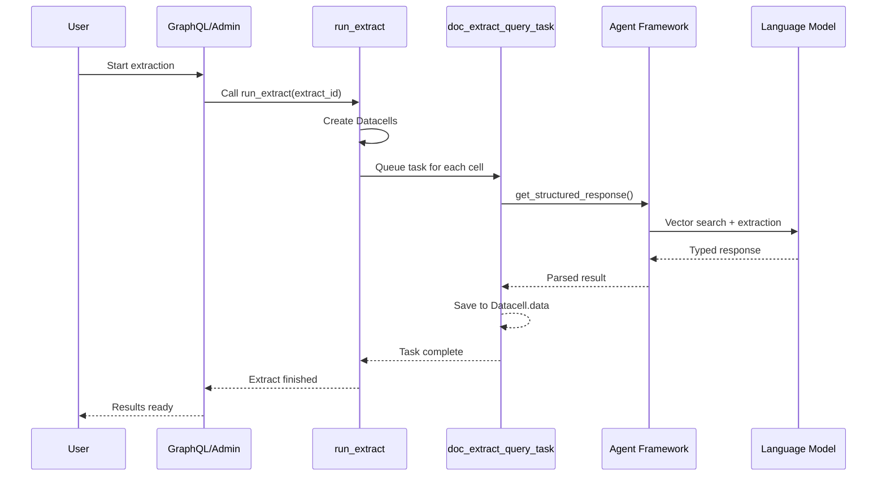

# Extracting Structured Data from Documents

> **Status: Current implementation as of JSv4/frontend-cleanup branch**

## Overview

OpenContracts transforms any collection of documents into a **spreadsheet-like data grid**. You define *what* to extract via a **Fieldset**, and the system:

1. Fans out work across documents and columns using Celery
2. Uses our **structured extraction API** powered by PydanticAI agents
3. Enforces constraints through intelligent prompting
4. Parses results into Python primitives or Pydantic models with guaranteed type safety

Everything is orchestrated by two Celery tasks:
- **`run_extract`** – creates individual cells and queues work
- **`doc_extract_query_task`** – performs the actual extraction using our agent framework

## Data Models

### Fieldset

Groups related columns together. Each Fieldset represents a specific configuration of data fields to extract.

```python
class Fieldset(BaseOCModel):
    name = models.CharField(max_length=256)
    description = models.TextField()

    # Optional: Link to corpus for metadata schemas
    corpus = models.OneToOneField(
        "corpuses.Corpus",
        related_name="metadata_schema",
        null=True,
        blank=True
    )
```

**Key features:**
- Defines the schema for extraction
- Can be linked to a corpus as its metadata schema
- Supports permissions for access control

### Column

Defines individual data fields to extract. Each column specifies what to extract, criteria, and output format.

```python
class Column(BaseOCModel):
    name = models.CharField(max_length=256)
    fieldset = models.ForeignKey('Fieldset', related_name='columns')

    # Extraction configuration
    query = models.TextField(null=True)           # The extraction prompt
    match_text = models.TextField(null=True)       # Alternative to query
    must_contain_text = models.TextField(null=True)  # Constraint
    limit_to_label = models.CharField(max_length=512, null=True)

    # Output configuration
    output_type = models.TextField()               # Python type as string
    extract_is_list = models.BooleanField(default=False)

    # Task selection
    task_name = models.CharField(
        default="opencontractserver.tasks.data_extract_tasks.doc_extract_query_task"
    )

    # Metadata fields for manual entry
    data_type = models.CharField(choices=METADATA_DATA_TYPES, null=True)
    validation_config = NullableJSONField(null=True)
```

**Column configuration:**
- **`query`** or **`match_text`**: The extraction prompt (one required)
- **`output_type`**: Python type as string (e.g., "str", "int", "list[str]")
- **`extract_is_list`**: Wraps the type in `List[]`
- **`must_contain_text`**: Only extract from sections containing this text
- **`limit_to_label`**: Only extract from annotations with this label
- **`instructions`**: Additional context for extraction
- **`data_type`**: For manual entry fields (STRING, INTEGER, DATE, etc.)
- **`validation_config`**: JSON configuration for field validation

### Extract

Represents an extraction job, containing metadata about the process.

```python
class Extract(BaseOCModel):
    corpus = models.ForeignKey('Corpus', null=True)
    documents = models.ManyToManyField('Document')
    name = models.CharField(max_length=512)
    fieldset = models.ForeignKey('Fieldset')

    # Timestamps
    created = models.DateTimeField(auto_now_add=True)
    started = models.DateTimeField(null=True)
    finished = models.DateTimeField(null=True)
    error = models.TextField(null=True)
```

**Usage:**
- Groups documents to process with the fieldset defining what to extract
- Tracks extraction progress and completion status
- Stores error information if extraction fails

### Datacell

Stores the result of extracting a specific column from a specific document.

```python
class Datacell(BaseOCModel):
    extract = models.ForeignKey('Extract', related_name='extracted_datacells')
    column = models.ForeignKey('Column', related_name='extracted_datacells')
    document = models.ForeignKey('Document', related_name='extracted_datacells')

    # Results
    data = NullableJSONField(null=True)
    data_definition = models.TextField()
    sources = models.ManyToManyField('Annotation')

    # Status tracking
    started = models.DateTimeField(null=True)
    completed = models.DateTimeField(null=True)
    failed = models.DateTimeField(null=True)
    stacktrace = models.TextField(null=True)
```

**Features:**
- Stores extracted data in JSON format
- Links to source annotations (when available)
- Tracks processing status and errors

## Extraction Pipeline

### Orchestration (`run_extract`)

The main orchestrator task that creates and manages extraction jobs:

```python
@shared_task
def run_extract(extract_id: Optional[str | int], user_id: str | int):
    # Creates Datacells for each document × column pair
    # Queues doc_extract_query_task for each cell
    # Uses chord to wait for completion
```

**Key operations:**
1. Creates one Datacell per document × column combination
2. Looks up the Celery task from `column.task_name`
3. Uses `chord(group(*tasks))` to wait for all cells
4. Calls `mark_extract_complete` when finished

### Per-Cell Extraction (`doc_extract_query_task`)

The async task that performs actual extraction using our agent framework:

```python
@celery_task_with_async_to_sync()
async def doc_extract_query_task(
    cell_id: int,
    similarity_top_k: int = 10,
    max_token_length: int = 64000
) -> None:
    """Agent-based data extraction pipeline using PydanticAI."""
```

**Extraction steps:**

1. **Setup**: Fetch Datacell, mark as started, validate corpus membership
2. **Type parsing**: Convert `column.output_type` string to Python type
3. **Prompt construction**: Build extraction prompt from query or match_text
4. **System prompt**: Add constraints from must_contain_text and limit_to_label
5. **Extract**: Call `agents.get_structured_response_from_document()`
6. **Save results**: Convert response to appropriate format and mark complete

### Async Task Decorator Pattern

The extraction task uses our custom decorator to handle async functions in Celery:

```python
@celery_task_with_async_to_sync()
async def doc_extract_query_task(...) -> None:
    # Async implementation
```

This decorator:
- Converts async functions to sync using `asgiref.sync.async_to_sync`
- Properly handles database connections
- Works seamlessly in test and production environments
- Avoids complex event loop management

**Testing async tasks:**
```python
from django.test import TransactionTestCase

class ExtractionTestCase(TransactionTestCase):
    def test_extraction(self):
        # Create datacell...
        doc_extract_query_task.si(datacell.id).apply()
        # Assert results...
```

## Sequence Diagram



## Supported Output Types

The system supports extraction to various Python types:

### Primitive Types
- `str` - Text strings
- `int` - Integers
- `float` - Floating point numbers
- `bool` - Boolean values

### Collection Types
- `list[str]` - List of strings
- `list[int]` - List of integers
- Use `extract_is_list=True` to wrap any type in a list

### Complex Types
- JSON objects via `dict` type
- Custom Pydantic models (planned)

## Constraints and Filtering

### Document Section Filtering

Use `must_contain_text` to limit extraction to specific sections:
```python
column.must_contain_text = "CONFIDENTIALITY"
# Only extracts from sections containing this text
```

### Annotation Label Filtering

Use `limit_to_label` to extract only from specific annotation types:
```python
column.limit_to_label = "contract-term"
# Only processes annotations with this label
```

### Additional Instructions

Provide extra context via `instructions`:
```python
column.instructions = "Extract as ISO 8601 date format"
```

## Error Handling

The extraction pipeline includes comprehensive error tracking:

1. **Cell-level errors**: Stored in `Datacell.stacktrace`
2. **Extract-level errors**: Stored in `Extract.error`
3. **Automatic retry**: Failed cells can be retried
4. **Partial completion**: Successful cells are saved even if others fail

## Performance Optimization

### Parallel Processing
- Extraction tasks run in parallel across Celery workers
- Each document × column combination is independent
- Scales horizontally with additional workers

### Vector Search Efficiency
- Uses pgvector for fast similarity search
- Caches embeddings for reuse
- Limits token context to `max_token_length`

### Database Optimization
- Batch creates Datacells
- Uses select_related/prefetch_related
- Minimizes database round trips

## Configuration

### Framework Selection

Set the agent framework in settings:
```python
LLMS_DEFAULT_AGENT_FRAMEWORK = "pydantic_ai"
```

### Custom Task Registration

Register custom extraction tasks:
```python
# In your app's tasks.py
@shared_task
def custom_extract_task(cell_id: int):
    # Custom extraction logic
    pass

# In Column configuration
column.task_name = "myapp.tasks.custom_extract_task"
```

## Next Steps

- **Complex types**: Expand output_type to support JSON schemas
- **Multi-step extraction**: Leverage conversation history
- **Cross-document aggregation**: Use corpus agents for analysis
- **Custom models**: Allow registration of Pydantic models
