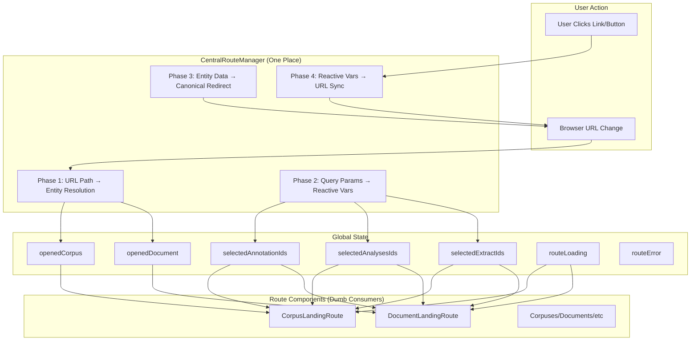

# OpenContracts Routing System Documentation

## Table of Contents

1. [Overview](#overview)
2. [Architecture](#architecture)
3. [Route Patterns](#route-patterns)
4. [CentralRouteManager](#centralroutemanager)
5. [Route Components](#route-components)
6. [State Management](#state-management)
7. [Navigation Utilities](#navigation-utilities)
8. [Testing](#testing)
9. [Best Practices](#best-practices)

## Overview

The OpenContracts routing system follows a **centralized architecture** where **one component rules them all**: `CentralRouteManager`. This component handles ALL URL ↔ State synchronization, entity fetching, and canonical redirects, while route components are simple consumers of global state.

### Key Principles

- **One Place to Rule Them All**: `CentralRouteManager` is the single source of truth for routing
- **Four-Phase Architecture**: Clean separation of URL parsing, query params, redirects, and sync
- **Explicit Routes**: Clear patterns with `/c/` and `/d/` prefixes eliminate ambiguity
- **Slug-First**: SEO-friendly URLs with automatic ID → slug redirection
- **Dumb Consumers**: Route components just read reactive vars and render
- **URL as Source of Truth**: No persistent state, URL drives everything
- **Centralized Query Params**: All selection (`?ann=`, `?analysis=`) and visualization (`?structural=`, `?labels=`) params handled in one place
- **Auth-Gated Resolution**: Entity fetching waits for authentication to prevent 401/403 errors on deep links
- **Complete Viewer State**: URLs encode full document viewer state (selections + visualization settings)

### The Critical Convention

**ONLY `CentralRouteManager` is allowed to SET the following reactive variables:**

**Entity State (set by Phase 1):**
- `openedCorpus()`
- `openedDocument()`
- `openedExtract()`

**URL-Driven State (set by Phase 2, watched by Phase 4):**
- `selectedAnnotationIds()`
- `selectedAnalysesIds()`
- `selectedExtractIds()` (when in browse/entity context, NOT on `/e/` routes where it's entity state)
- `showStructuralAnnotations()`
- `showSelectedAnnotationOnly()`
- `showAnnotationBoundingBoxes()`
- `showAnnotationLabels()`

**ALL other components must:**
- **ONLY READ** these reactive vars with `useReactiveVar()`
- **NEVER SET** these reactive vars directly
- **UPDATE STATE** by using navigation utilities that update the URL

**The Correct Pattern:**
Components wanting to change URL-driven state must use utility functions that update the URL. CentralRouteManager Phase 2 will detect the URL change and set the reactive var. This maintains unidirectional data flow: Component → URL → CentralRouteManager → Reactive Var → Component.

This is non-negotiable. Violations cause infinite loops, route jittering, competing state updates, and unpredictable behavior. During development, we systematically removed all violations from:
- `CorpusDocumentCards.tsx` (caused infinite loop bug)
- `DocumentKnowledgeBase.tsx` (4 violations)
- `FloatingDocumentControls.tsx` (1 violation)
- `NavMenu.tsx` / `MobileNavMenu.tsx` (clearing on menu clicks)
- `CorpusBreadcrumbs.tsx` (manual clearing)
- `Corpuses.tsx` (3 violations)
- Deleted obsolete `RouteStateSync.ts` hook (14 violations)

**If you find yourself writing `openedCorpus(someValue)`, `openedDocument(someValue)`, or `openedExtract(someValue)` anywhere except `CentralRouteManager.tsx`, STOP. You are introducing a bug.**

### Design Decisions

**Why Centralized?**
- Previous scattered approach had URL parsing in 6+ locations
- Circular dependencies between components
- Duplicate entity fetching
- Difficult to maintain and test

**The Solution:**
- `CentralRouteManager` owns all routing logic (`src/routing/CentralRouteManager.tsx`)
- Route components are ~40 lines (was ~180 lines)
- Single GraphQL query per route
- Predictable state flow: URL → Manager → Reactive Vars → Components

## Architecture



### Four-Phase Flow

**Phase 1: URL Path → Entity Resolution** (`CentralRouteManager.tsx:116-330`)
- Parse pathname: `/c/john/corpus` → `{ type: "corpus", userIdent: "john", corpusIdent: "corpus" }`
- Detect entity routes vs browse routes
- Fetch entities via GraphQL (corpus/document)
- Set `openedCorpus`/`openedDocument` reactive vars
- Handle loading/error states

**Phase 2: URL Query Params → Reactive Vars** (`CentralRouteManager.tsx:444-484`)
- Extract selection params → reactive vars:
  - `?ann=123,456` → `selectedAnnotationIds(["123", "456"])`
  - `?analysis=789` → `selectedAnalysesIds(["789"])`
  - `?extract=101` → `selectedExtractIds(["101"])`
- Extract visualization params → reactive vars:
  - `?structural=true` → `showStructuralAnnotations(true)`
  - `?selectedOnly=true` → `showSelectedAnnotationOnly(true)`
  - `?boundingBoxes=true` → `showAnnotationBoundingBoxes(true)`
  - `?labels=ALWAYS` → `showAnnotationLabels("ALWAYS")`
- Centralized for ALL routes (corpus, document, browse)
- Enables deep linking with complete viewer state

**Phase 3: Entity Data → Canonical Redirects** (`CentralRouteManager.tsx:349-372`)
- Check if URL matches canonical slug path
- Redirect `/c/john/old-slug` → `/c/john-doe/normalized-slug`
- Preserve query parameters during redirect
- Ensure SEO-friendly URLs

**Phase 4: Reactive Vars → URL Sync** (`CentralRouteManager.tsx:514-544`)
- Watch selection reactive vars (user selects annotation/analysis)
- Watch visualization reactive vars (user toggles structural/bounding boxes)
- Build query string: `ann=123&analysis=456&structural=true&labels=ALWAYS`
- Update URL with `navigate({ search: queryString }, { replace: true })`
- Bidirectional: URL drives state, state updates URL
- Only adds non-default visualization values to keep URLs clean

## Route Patterns

### Entity Routes (Full Object Fetching)

| Pattern                                 | Example                       | Component            | CentralRouteManager Action |
| --------------------------------------- | ----------------------------- | -------------------- | -------------------------- |
| `/c/:userIdent/:corpusIdent`           | `/c/john/my-corpus`           | CorpusLandingRoute   | Phase 1: Fetch corpus      |
| `/d/:userIdent/:docIdent`              | `/d/john/my-document`         | DocumentLandingRoute | Phase 1: Fetch document    |
| `/d/:userIdent/:corpusIdent/:docIdent` | `/d/john/corpus/doc`          | DocumentLandingRoute | Phase 1: Fetch both        |
| `/e/:userIdent/:extractIdent`          | `/e/john/extract-123`         | ExtractLandingRoute  | Phase 1: Fetch extract     |

### Browse Routes (Query Params Only)

| Pattern        | Example                    | Component    | CentralRouteManager Action    |
| -------------- | -------------------------- | ------------ | ----------------------------- |
| `/corpuses`    | `/corpuses?analysis=123`   | Corpuses     | Phase 2: Parse query params   |
| `/documents`   | `/documents`               | Documents    | Phase 2: Parse query params   |
| `/annotations` | `/annotations?ann=123,456` | Annotations  | Phase 2: Parse query params   |
| `/extracts`    | `/extracts?extract=789`    | Extracts     | Phase 2: Parse query params   |
| `/label_sets`  | `/label_sets`              | Labelsets    | No action (simple list view)  |

### Query Parameters (All Routes)

**Selection Parameters:**

| Parameter    | Purpose                     | Example                           | Set By         |
| ------------ | --------------------------- | --------------------------------- | -------------- |
| `?ann=`      | Select annotations          | `?ann=123,456,789`                | Phase 2 or 4   |
| `?analysis=` | Select analyses             | `?analysis=123,456`               | Phase 2 or 4   |
| `?extract=`  | Select extracts             | `?extract=456,789`                | Phase 2 or 4   |

**Visualization Parameters (Document Viewer):**

| Parameter         | Purpose                          | Values                      | Default      | Set By     |
| ----------------- | -------------------------------- | --------------------------- | ------------ | ---------- |
| `?structural=`    | Show structural annotations      | `true` or omit              | `false`      | Phase 2/4  |
| `?selectedOnly=`  | Show only selected annotations   | `true` or omit              | `false`      | Phase 2/4  |
| `?boundingBoxes=` | Show annotation bounding boxes   | `true` or omit              | `false`      | Phase 2/4  |
| `?labels=`        | Label display behavior           | `ALWAYS\|ON_HOVER\|HIDE`    | `ON_HOVER`   | Phase 2/4  |

**Examples:**
```bash
# Corpus with selections
/c/john/legal-corpus?analysis=5678&extract=9012

# Document with annotation (structural annotations visible for deep linking)
/d/jane/contract?ann=1234&structural=true

# Document with full visualization state
/d/john/corpus/doc?ann=1,2&analysis=3&structural=true&boundingBoxes=true&labels=ALWAYS

# Browse with highlighting
/annotations?ann=123,456

# Deep link to structural annotation with optimal viewer settings
/d/user/corpus/document?ann=structural-ann-123&structural=true&selectedOnly=true&labels=ALWAYS
```

### Route Configuration

**App.tsx** (lines 301-343):
```typescript
{/* CentralRouteManager handles ALL URL ↔ State sync */}
<CentralRouteManager />

<Routes>
  {/* Entity routes */}
  <Route path="/d/:userIdent/:corpusIdent/:docIdent" element={<DocumentLandingRoute />} />
  <Route path="/d/:userIdent/:docIdent" element={<DocumentLandingRoute />} />
  <Route path="/c/:userIdent/:corpusIdent" element={<CorpusLandingRoute />} />

  {/* Browse routes */}
  <Route path="/corpuses" element={<Corpuses />} />
  <Route path="/documents" element={<Documents />} />
  <Route path="/annotations" element={<Annotations />} />
  <Route path="/extracts" element={<Extracts />} />
  <Route path="/label_sets" element={<Labelsets />} />

  {/* 404 */}
  <Route path="/404" element={<NotFound />} />
  <Route path="*" element={<NotFound />} />
</Routes>
```

### ID-Based Navigation (Auto-Redirect)

CentralRouteManager automatically detects IDs and redirects to canonical slug URLs:

✅ `/c/john/Q29ycHVzOjEyMw==` → `/c/john-doe/my-corpus`
✅ `/d/jane/4567` → `/d/jane/my-document`
✅ `/d/john/corpus/7890` → `/d/john/corpus/doc-slug`

**Detection Logic** (`utils/navigationUtils.ts:getIdentifierType()`):
- Base64 strings (e.g., `Q29ycHVzOjEyMw==`)
- Numeric IDs ≥4 digits (e.g., `1234`, `456789`)
- GID format (e.g., `gid://app/Corpus/123`)

## CentralRouteManager

**Location:** `src/routing/CentralRouteManager.tsx`

### Core Responsibilities

1. **Parse URLs** → Determine route type (corpus/document/extract/browse)
2. **Fetch Entities** → GraphQL queries for corpus/document/extract
3. **Extract Query Params** → Parse `?ann=`, `?analysis=`, `?extract=`
4. **Set Global State** → Update reactive vars
5. **Canonical Redirects** → Ensure SEO-friendly URLs (ID → slug for corpus/document)
6. **Bidirectional Sync** → Watch state changes, update URL

### Implementation Details

**Phase 1: Entity Resolution** (lines 116-330)
```typescript
useEffect(() => {
  const route = parseRoute(location.pathname);

  // Browse routes - clear entities
  if (route.type === "browse" || route.type === "unknown") {
    openedCorpus(null);
    openedDocument(null);
    openedExtract(null);
    routeLoading(false);
    return;
  }

  // Entity routes - fetch from GraphQL
  if (route.type === "corpus") {
    // RESOLVE_CORPUS_BY_SLUGS_FULL
    const { data } = await resolveCorpus({
      variables: { userSlug, corpusSlug }
    });
    openedCorpus(data.corpusBySlugs);
    openedDocument(null);
    openedExtract(null);
  }

  if (route.type === "document") {
    // RESOLVE_DOCUMENT_BY_SLUGS_FULL or
    // RESOLVE_DOCUMENT_IN_CORPUS_BY_SLUGS_FULL
    const { data } = await resolveDocument(...);
    openedDocument(data.documentBySlugs);
    openedCorpus(data.corpusBySlugs || null);
    openedExtract(null);
  }

  if (route.type === "extract") {
    // RESOLVE_EXTRACT_BY_ID (extracts use IDs, not slugs yet)
    const { data } = await resolveExtract({
      variables: { extractId: route.extractIdent }
    });
    openedExtract(data.extract);
    openedCorpus(null);
    openedDocument(null);
  }
}, [location.pathname]);
```

**Phase 2: Query Params** (lines 444-484)
```typescript
useEffect(() => {
  // Selection state
  const annIds = parseQueryParam(searchParams.get("ann"));
  const analysisIds = parseQueryParam(searchParams.get("analysis"));
  const extractIds = parseQueryParam(searchParams.get("extract"));

  // Visualization state
  const structural = searchParams.get("structural") === "true";
  const selectedOnly = searchParams.get("selectedOnly") === "true";
  const boundingBoxes = searchParams.get("boundingBoxes") === "true";
  const labelsParam = searchParams.get("labels");

  // Update reactive vars
  selectedAnnotationIds(annIds);
  selectedAnalysesIds(analysisIds);
  selectedExtractIds(extractIds);
  showStructuralAnnotations(structural);
  showSelectedAnnotationOnly(selectedOnly);
  showAnnotationBoundingBoxes(boundingBoxes);

  if (labelsParam === "ALWAYS") {
    showAnnotationLabels("ALWAYS");
  } else if (labelsParam === "HIDE") {
    showAnnotationLabels("HIDE");
  } else {
    showAnnotationLabels("ON_HOVER");
  }
}, [searchParams]);
```

**Phase 3: Canonical Redirects** (lines 349-372)
```typescript
useEffect(() => {
  const canonicalPath = buildCanonicalPath(document, corpus);
  if (canonicalPath && currentPath !== canonicalPath) {
    navigate(canonicalPath + location.search, { replace: true });
  }
}, [corpus, document, location.pathname]);
```

**Phase 4: URL Sync** (lines 514-544)
```typescript
// Watch reactive vars
const annIds = useReactiveVar(selectedAnnotationIds);
const analysisIds = useReactiveVar(selectedAnalysesIds);
const extractIds = useReactiveVar(selectedExtractIds);
const structural = useReactiveVar(showStructuralAnnotations);
const selectedOnly = useReactiveVar(showSelectedAnnotationOnly);
const boundingBoxes = useReactiveVar(showAnnotationBoundingBoxes);
const labels = useReactiveVar(showAnnotationLabels);

useEffect(() => {
  // CRITICAL: Don't sync on initial mount - wait for Phase 2 to read URL first
  if (!hasInitializedFromUrl.current) {
    return;
  }

  // CRITICAL: Don't sync while route is loading!
  // Prevents race condition where Phase 4 reads stale reactive vars before Phase 2 updates them
  if (routeLoading()) {
    return;
  }

  const queryString = buildQueryParams({
    annotationIds: annIds,
    analysisIds,
    extractIds,
    showStructural: structural,
    showSelectedOnly: selectedOnly,
    showBoundingBoxes: boundingBoxes,
    labelDisplay: labels,
  });

  if (currentSearch !== queryString) {
    navigate({ search: queryString }, { replace: true });
  }
}, [annIds, analysisIds, extractIds, structural, selectedOnly, boundingBoxes, labels]);
```

### GraphQL Queries

**Corpus Resolution** (`src/graphql/queries.ts:RESOLVE_CORPUS_BY_SLUGS_FULL`):
```graphql
query ResolveCorpusBySlugsFull($userSlug: String!, $corpusSlug: String!) {
  corpusBySlugs(userSlug: $userSlug, corpusSlug: $corpusSlug) {
    id
    slug
    title
    description
    creator { id username slug }
    labelSet { id title }
    myPermissions
    isPublic
  }
}
```

**Document Resolution** (`src/graphql/queries.ts:RESOLVE_DOCUMENT_BY_SLUGS_FULL`):
```graphql
query ResolveDocumentBySlugsFull($userSlug: String!, $documentSlug: String!) {
  documentBySlugs(userSlug: $userSlug, documentSlug: $documentSlug) {
    id
    slug
    title
    description
    creator { id username slug }
    corpus { id slug title creator { id slug } }
    pdfFile { id url }
  }
}
```

**Extract Resolution** (`src/graphql/queries.ts:RESOLVE_EXTRACT_BY_ID`):
```graphql
query ResolveExtractById($extractId: ID!) {
  extract(id: $extractId) {
    id
    name
    created
    started
    finished
    error
    myPermissions
    creator { id username slug }
    corpus { id slug title creator { id slug } }
    fieldset { id name description }
  }
}
```

**Document in Corpus** (`src/graphql/queries.ts:RESOLVE_DOCUMENT_IN_CORPUS_BY_SLUGS_FULL`):
```graphql
query ResolveDocumentInCorpusBySlugsFull(
  $userSlug: String!
  $corpusSlug: String!
  $documentSlug: String!
) {
  corpusBySlugs(userSlug: $userSlug, corpusSlug: $corpusSlug) { ... }
  documentInCorpusBySlugs(
    userSlug: $userSlug
    corpusSlug: $corpusSlug
    documentSlug: $documentSlug
  ) { ... }
}
```

### Performance Optimizations

**Request Deduplication** (`utils/performanceMonitoring.ts:RequestTracker`):
```typescript
// Prevents duplicate simultaneous requests
if (requestTracker.isPending(requestKey)) {
  return; // Skip duplicate request
}

await requestTracker.trackRequest(requestKey, async () => {
  // Perform GraphQL query
});
```

**Route Processing Guard** (line 120-123):
```typescript
// Skip if we've already processed this exact path
if (lastProcessedPath.current === currentPath) {
  return;
}
lastProcessedPath.current = currentPath;
```

**Apollo Cache**:
```typescript
fetchPolicy: "cache-first"
nextFetchPolicy: "cache-and-network"
```

## Route Components

Route components are now **dumb consumers** that read reactive vars and render UI.

### DocumentLandingRoute

**Location:** `src/components/routes/DocumentLandingRoute.tsx` (48 lines, was 180)

```typescript
export const DocumentLandingRoute: React.FC = () => {
  const navigate = useNavigate();

  // Just read state from reactive vars (set by CentralRouteManager)
  const document = useReactiveVar(openedDocument);
  const corpus = useReactiveVar(openedCorpus);
  const loading = useReactiveVar(routeLoading);
  const error = useReactiveVar(routeError);

  // Loading/error states
  if (loading) return <ModernLoadingDisplay type="document" />;
  if (error || !document) return <ModernErrorDisplay error={error} />;

  // Close handler
  const handleClose = () => {
    if (corpus) {
      navigate(`/c/${corpus.creator.slug}/${corpus.slug}`);
    } else {
      navigate("/documents");
    }
  };

  // Just render with hydrated data
  return (
    <ErrorBoundary>
      <MetaTags title={document.title} type="document" />
      <DocumentKnowledgeBase
        documentId={document.id}
        corpusId={corpus?.id}
        onClose={handleClose}
      />
    </ErrorBoundary>
  );
};
```

**Key Points:**
- No `useParams()` → CentralRouteManager owns URL parsing
- No GraphQL queries → CentralRouteManager fetches entities
- No URL sync → CentralRouteManager handles query params
- Just reads `openedDocument`, `openedCorpus`, `routeLoading`, `routeError`
- Pure view logic

### CorpusLandingRoute

**Location:** `src/components/routes/CorpusLandingRoute.tsx` (42 lines, was 120)

```typescript
export const CorpusLandingRoute: React.FC = () => {
  const corpus = useReactiveVar(openedCorpus);
  const loading = useReactiveVar(routeLoading);
  const error = useReactiveVar(routeError);

  if (loading) return <ModernLoadingDisplay type="corpus" />;
  if (error || !corpus) return <ModernErrorDisplay error={error} />;

  return (
    <ErrorBoundary>
      <MetaTags title={corpus.title} type="corpus" />
      <Corpuses />
    </ErrorBoundary>
  );
};
```

### Browse Views (Corpuses, Documents, Annotations, Extracts)

**Example:** `src/views/Annotations.tsx`

```typescript
export const Annotations = () => {
  // URL query parameters already set by CentralRouteManager
  const annotation_ids = useReactiveVar(selectedAnnotationIds);
  const analysis_ids = useReactiveVar(selectedAnalysesIds);

  // Just consume the state and render
  return <AnnotationCards />;
};
```

**What They DON'T Do:**
- ❌ No `useParams()` extraction
- ❌ No entity fetching by route
- ❌ No URL query param parsing
- ❌ No canonical redirects

**What They DO:**
- ✅ Read reactive vars
- ✅ Fetch lists (not entities)
- ✅ Display UI
- ✅ Update selections via URL utilities (CentralRouteManager Phase 2 sets reactive vars)

## State Management

### Global Reactive Variables

**Location:** `src/graphql/cache.ts`

```typescript
// Entity state (set by CentralRouteManager Phase 1)
export const openedCorpus = makeVar<CorpusType | null>(null);
export const openedDocument = makeVar<DocumentType | null>(null);
export const openedExtract = makeVar<ExtractType | null>(null);

// Selection state (set by CentralRouteManager Phase 2, watched by Phase 4)
export const selectedAnnotationIds = makeVar<string[]>([]);
export const selectedAnalysesIds = makeVar<string[]>([]);
export const selectedExtractIds = makeVar<string[]>([]);

// Visualization state (set by CentralRouteManager Phase 2, watched by Phase 4)
export const showStructuralAnnotations = makeVar<boolean>(false);
export const showSelectedAnnotationOnly = makeVar<boolean>(false);
export const showAnnotationBoundingBoxes = makeVar<boolean>(false);
export const showAnnotationLabels = makeVar<LabelDisplayBehavior>("ON_HOVER");

// Loading/error state (set by CentralRouteManager Phase 1)
export const routeLoading = makeVar<boolean>(false);
export const routeError = makeVar<Error | null>(null);
export const authStatusVar = makeVar<AuthStatus>("LOADING");
```

### State Flow

```
┌─────────────────────────────────────────────────────────────┐
│ URL: /c/john/my-corpus?analysis=123&extract=456            │
└─────────────────────────────────────────────────────────────┘
                          ↓
          ┌───────────────────────────┐
          │   CentralRouteManager     │
          │  (One Place to Rule All)  │
          └───────────────────────────┘
                    ↓           ↓
         ┌──────────────┐  ┌──────────────────────┐
         │ Phase 1      │  │ Phase 2              │
         │ Parse path   │  │ Parse query params   │
         │ Fetch corpus │  │ ?analysis=123        │
         └──────────────┘  │ ?extract=456         │
                ↓          └──────────────────────┘
    ┌───────────────────┐           ↓
    │ openedCorpus      │  ┌────────────────────────┐
    │ = CorpusType      │  │ selectedAnalysesIds    │
    │                   │  │ = ["123"]              │
    │ routeLoading      │  │                        │
    │ = false           │  │ selectedExtractIds     │
    └───────────────────┘  │ = ["456"]              │
                ↓          └────────────────────────┘
        ┌─────────────────────────┐
        │  CorpusLandingRoute     │
        │  (Dumb Consumer)        │
        │                         │
        │  const corpus =         │
        │    useReactiveVar(      │
        │      openedCorpus       │
        │    );                   │
        │                         │
        │  return <Corpuses />    │
        └─────────────────────────┘
                    ↓
            ┌──────────────┐
            │  Corpuses    │
            │  View        │
            │  Renders!    │
            └──────────────┘
```

### Bidirectional Sync Example

**User selects annotation → URL updates:**
```typescript
// Component updates URL via utility
updateAnnotationSelectionParams(location, navigate, {
  annotationIds: ["123", "456"],
});

// CentralRouteManager Phase 2 detects URL change
useEffect(() => {
  const annIds = parseQueryParam(searchParams.get("ann"));
  selectedAnnotationIds(annIds); // Sets reactive var
}, [searchParams]);

// CentralRouteManager Phase 4 keeps URL in sync if var changes from elsewhere
useEffect(() => {
  const queryString = buildQueryParams({ annotationIds: annIds, ... });
  navigate({ search: queryString }, { replace: true });
}, [annIds]);

// URL becomes: ?ann=123,456
```

**URL changes → Component updates:**
```typescript
// CentralRouteManager Phase 2 watches URL
useEffect(() => {
  const annIds = parseQueryParam(searchParams.get("ann"));
  selectedAnnotationIds(annIds); // ["123", "456"]
}, [searchParams]);

// Component reads reactive var
const annotation_ids = useReactiveVar(selectedAnnotationIds);
// Renders with: ["123", "456"]
```

## Navigation Utilities

**Location:** `src/utils/navigationUtils.ts`

### Core Functions

**parseRoute()** - Parse URL pathname
```typescript
parseRoute("/c/john/my-corpus")
// Returns: { type: "corpus", userIdent: "john", corpusIdent: "my-corpus" }

parseRoute("/d/john/corpus/doc")
// Returns: { type: "document", userIdent: "john",
//           corpusIdent: "corpus", documentIdent: "doc" }

parseRoute("/annotations")
// Returns: { type: "browse", browsePath: "annotations" }
```

**parseQueryParam()** - Parse comma-separated IDs
```typescript
parseQueryParam("123,456,789")
// Returns: ["123", "456", "789"]

parseQueryParam(null)
// Returns: []
```

**buildCanonicalPath()** - Build SEO-friendly path
```typescript
buildCanonicalPath(document, corpus, extract)
// Returns: "/d/john-doe/my-corpus/doc-slug"

buildCanonicalPath(document, null, null)
// Returns: "/d/jane/standalone-doc"

buildCanonicalPath(null, corpus, null)
// Returns: "/c/john/my-corpus"

buildCanonicalPath(null, null, extract)
// Returns: "/e/john/extract-123" (ID-based, no slugs yet)
```

**buildQueryParams()** - Build query string
```typescript
buildQueryParams({
  annotationIds: ["1", "2"],
  analysisIds: ["3"],
  extractIds: ["4"]
})
// Returns: "?ann=1,2&analysis=3&extract=4"
```

### Navigation Functions

**getCorpusUrl()** - Generate corpus URL
```typescript
getCorpusUrl(corpus)
// Returns: "/c/john/my-corpus"

getCorpusUrl(corpus, { analysisIds: ["123"] })
// Returns: "/c/john/my-corpus?analysis=123"

getCorpusUrl({ id: "1", slug: "" }) // Missing slug
// Returns: "#" (safe fallback)
```

**getDocumentUrl()** - Generate document URL
```typescript
getDocumentUrl(document, corpus)
// Returns: "/d/john/corpus/doc"

getDocumentUrl(document, null)
// Returns: "/d/jane/standalone-doc"

getDocumentUrl(document, corpus, {
  annotationIds: ["1"],
  analysisIds: ["2"],
  extractIds: ["3"]
})
// Returns: "/d/john/corpus/doc?ann=1&analysis=2&extract=3"
```

**getExtractUrl()** - Generate extract URL
```typescript
getExtractUrl(extract)
// Returns: "/e/john/extract-123"

getExtractUrl(extract, { analysisIds: ["456"] })
// Returns: "/e/john/extract-123?analysis=456"

getExtractUrl({ id: "1", creator: null }) // Missing creator
// Returns: "#" (safe fallback)
```

**navigateToCorpus()** - Smart corpus navigation
```typescript
navigateToCorpus(corpus, navigate, currentPath)
// Only navigates if not already there
// Pushes to browser history (not replace) so back button works

navigateToCorpus(corpus, navigate, currentPath, { analysisIds: ["123"] })
// Navigates with query params
```

**navigateToDocument()** - Smart document navigation
```typescript
navigateToDocument(document, corpus, navigate, currentPath)
// Only navigates if not already there
// Pushes to browser history (not replace) so back button works

navigateToDocument(document, corpus, navigate, currentPath, {
  annotationIds: ["456"]
})
// Navigates with query params
```

**navigateToExtract()** - Smart extract navigation
```typescript
navigateToExtract(extract, navigate, currentPath)
// Only navigates if not already there
// Pushes to browser history (not replace) so back button works

navigateToExtract(extract, navigate, currentPath, { analysisIds: ["123"] })
// Navigates with query params
```

**Important:** These navigation functions use `navigate(path)` (push) NOT `navigate(path, { replace: true })`. This ensures browser history is maintained and the back button works correctly. When a user opens a document/corpus, a new history entry is created, allowing them to use the browser back button to return to the previous view.

### State Update Utilities

**CRITICAL:** Components must NEVER directly set URL-driven reactive vars. Instead, use these utilities that update the URL, allowing CentralRouteManager Phase 2 to set the reactive var.

**updateAnnotationSelectionParams()** - Update selection state via URL
```typescript
import { updateAnnotationSelectionParams } from "../utils/navigationUtils";

// Component wants to change analysis selection
const handleSelectAnalysis = (analysisId: string) => {
  updateAnnotationSelectionParams(location, navigate, {
    analysisIds: [analysisId],
    extractIds: [],  // Clear extracts when selecting analysis
  });
  // CentralRouteManager Phase 2 will detect URL change and set selectedAnalysesIds
};

// Component wants to toggle annotation selection
const toggleAnnotation = (annotationId: string) => {
  const currentIds = useReactiveVar(selectedAnnotationIds);
  const newIds = currentIds.includes(annotationId)
    ? currentIds.filter(id => id !== annotationId)
    : [...currentIds, annotationId];

  updateAnnotationSelectionParams(location, navigate, {
    annotationIds: newIds,
  });
};
```

**updateAnnotationDisplayParams()** - Update visualization state via URL
```typescript
import { updateAnnotationDisplayParams } from "../utils/navigationUtils";

// Component wants to change display settings
const handleToggleStructural = (value: boolean) => {
  updateAnnotationDisplayParams(location, navigate, {
    showStructural: value,
  });
  // CentralRouteManager Phase 2 will detect URL change and set showStructuralAnnotations
};

// Setting multiple visualization params at once
const viewExtractAnnotations = () => {
  updateAnnotationDisplayParams(location, navigate, {
    showStructural: true,
    showBoundingBoxes: true,
    showSelectedOnly: false,
    labelDisplay: "ALWAYS",
  });
};
```

**clearAnnotationSelection()** - Clear all selection state via URL
```typescript
import { clearAnnotationSelection } from "../utils/navigationUtils";

// Cleanup on component unmount
useEffect(() => {
  return () => {
    clearAnnotationSelection(location, navigate);
  };
}, [location, navigate]);
```

**Why These Utilities?**
- Maintains unidirectional data flow: Component → URL → CentralRouteManager → Reactive Var
- Prevents competing writes to reactive vars
- Ensures URL is always source of truth
- Avoids infinite loops and race conditions

### Usage in Components

```typescript
// Card component
const handleClick = () => {
  const url = getDocumentUrl(document, corpus, {
    annotationIds: [annotation.id]
  });
  if (url !== "#") {
    navigate(url);
  }
};

// Smart navigation (checks if already there)
const handleNavigate = () => {
  navigateToDocument(document, corpus, navigate, location.pathname, {
    annotationIds: selectedAnnotationIds(),
    analysisIds: selectedAnalysesIds()
  });
};
```

## Testing

### Unit Tests

**navigationUtils.test.ts** (74 tests):
```typescript
describe("parseRoute()", () => {
  it("should parse corpus route", () => {
    expect(parseRoute("/c/john/my-corpus")).toEqual({
      type: "corpus",
      userIdent: "john",
      corpusIdent: "my-corpus"
    });
  });

  it("should parse browse routes", () => {
    expect(parseRoute("/annotations")).toEqual({
      type: "browse",
      browsePath: "annotations"
    });
  });
});

describe("buildQueryParams()", () => {
  it("should build query string", () => {
    expect(buildQueryParams({
      annotationIds: ["1", "2"],
      analysisIds: ["3"]
    })).toBe("?ann=1,2&analysis=3");
  });
});
```

### Integration Tests

**CentralRouteManager.test.tsx** (21 tests, 500+ lines):
```typescript
describe("Phase 1: URL Path → Entity Resolution", () => {
  it("should resolve corpus from slug-based URL", async () => {
    const mocks = [/* GraphQL mock */];

    render(
      <MockedProvider mocks={mocks}>
        <MemoryRouter initialEntries={["/c/john/my-corpus"]}>
          <CentralRouteManager />
        </MemoryRouter>
      </MockedProvider>
    );

    expect(routeLoading()).toBe(true);
    await waitFor(() => expect(routeLoading()).toBe(false));
    expect(openedCorpus()).toEqual(mockCorpus);
  });
});

describe("Phase 2: Query Params → Reactive Vars", () => {
  it("should parse annotation IDs from URL", () => {
    render(
      <MemoryRouter initialEntries={["/annotations?ann=123,456"]}>
        <CentralRouteManager />
      </MemoryRouter>
    );

    expect(selectedAnnotationIds()).toEqual(["123", "456"]);
  });
});

describe("Phase 4: Reactive Vars → URL Sync", () => {
  it("should update URL when annotation IDs change", async () => {
    render(<CentralRouteManager />);

    selectedAnnotationIds(["new-123"]);

    await waitFor(() => {
      expect(mockNavigate).toHaveBeenCalledWith(
        { search: "ann=new-123" },
        { replace: true }
      );
    });
  });
});
```

**routing-integration.test.tsx** (7 full-flow tests):
```typescript
it("should flow from URL → Manager → Reactive Vars → Component", async () => {
  const mocks = [/* corpus mock */];

  render(
    <MockedProvider mocks={mocks}>
      <MemoryRouter initialEntries={["/c/john/my-corpus?analysis=123"]}>
        <CentralRouteManager />
        <Routes>
          <Route path="/c/:userIdent/:corpusIdent" element={<CorpusLandingRoute />} />
        </Routes>
      </MemoryRouter>
    </MockedProvider>
  );

  // Phase 1: Loading
  expect(routeLoading()).toBe(true);

  // Phase 2: Wait for resolution
  await waitFor(() => expect(routeLoading()).toBe(false));

  // Phase 3: Verify reactive vars
  expect(openedCorpus()).toEqual(mockCorpus);
  expect(selectedAnalysesIds()).toEqual(["123"]);

  // Phase 4: Verify component rendered
  expect(screen.getByTestId("corpus-view")).toBeInTheDocument();
});
```

### Route Component Tests

**DocumentLandingRoute.test.tsx** (6 tests):
```typescript
describe("State-Driven Rendering", () => {
  beforeEach(() => {
    openedDocument(null);
    routeLoading(false);
    routeError(null);
  });

  it("should show loading when routeLoading is true", () => {
    routeLoading(true);
    render(<DocumentLandingRoute />);
    expect(screen.getByText("Loading...")).toBeInTheDocument();
  });

  it("should render view when document is loaded", () => {
    openedDocument(mockDocument);
    routeLoading(false);
    render(<DocumentLandingRoute />);
    expect(screen.getByText("DocumentKnowledgeBase")).toBeInTheDocument();
  });
});
```

## Best Practices

### Critical Rules (MUST Follow)

**🚨 RULE #1: NEVER Set `openedCorpus`, `openedDocument`, or `openedExtract` Outside CentralRouteManager**

```typescript
// ❌ NEVER DO THIS (anywhere except CentralRouteManager.tsx):
openedCorpus(someCorpus);
openedDocument(someDocument);
openedExtract(someExtract);
openedCorpus(null);
openedDocument(null);
openedExtract(null);

// ✅ ALWAYS DO THIS:
const corpus = useReactiveVar(openedCorpus);  // Read only
const document = useReactiveVar(openedDocument);  // Read only
const extract = useReactiveVar(openedExtract);  // Read only
```

**Why?** Setting these vars from multiple places creates competing state updates, infinite loops, and route jittering. We learned this the hard way when `CorpusDocumentCards.tsx` was fetching corpus data and setting `openedCorpus()`, creating an infinite loop with `CentralRouteManager`.

**🚨 RULE #2: NEVER Fetch Entities in Route Components**

```typescript
// ❌ NEVER DO THIS in route components:
const { data } = useQuery(GET_CORPUS_BY_ID, {
  onCompleted: (data) => {
    openedCorpus(data.corpus);  // VIOLATION!
  }
});

// ✅ CentralRouteManager handles ALL entity fetching:
// - Corpus resolution via RESOLVE_CORPUS_BY_SLUGS_FULL
// - Document resolution via RESOLVE_DOCUMENT_BY_SLUGS_FULL
// - Automatic caching and deduplication
```

**Why?** Duplicate fetching wastes bandwidth, creates race conditions, and makes caching impossible. Let CentralRouteManager do its job.

**🚨 RULE #3: NEVER Parse Route Parameters Outside CentralRouteManager**

```typescript
// ❌ NEVER DO THIS:
const { userIdent, corpusIdent } = useParams();
// Parse URL yourself...

// ✅ ALWAYS DO THIS:
const corpus = useReactiveVar(openedCorpus);
// CentralRouteManager already parsed the URL and fetched the corpus
```

**Why?** URL parsing logic should exist in exactly one place. Multiple parsers lead to inconsistencies and bugs.

**🚨 RULE #4: NEVER Manually Clear Route State**

```typescript
// ❌ NEVER DO THIS:
const gotoHome = () => {
  openedCorpus(null);  // VIOLATION!
  openedDocument(null);  // VIOLATION!
  openedExtract(null);  // VIOLATION!
  navigate("/corpuses");
};

// ✅ ALWAYS DO THIS:
const gotoHome = () => {
  navigate("/corpuses");
  // CentralRouteManager will detect the route change and clear state automatically
};
```

**Why?** CentralRouteManager watches the URL and automatically clears `openedCorpus`/`openedDocument`/`openedExtract` when navigating to browse routes. Manual clearing creates race conditions.

### DO ✅

**Routing:**
- ✅ Let CentralRouteManager handle ALL URL ↔ State sync
- ✅ Route components just read reactive vars with `useReactiveVar()`
- ✅ Use navigation utilities (`getCorpusUrl`, `getDocumentUrl`, etc.)
- ✅ Preserve query params when navigating
- ✅ Check for `"#"` return from URL generators (indicates missing data)
- ✅ Trust that CentralRouteManager will clear state when routes change

**State:**
- ✅ URL is source of truth (no persistent local state)
- ✅ Read entity vars: `const corpus = useReactiveVar(openedCorpus);`
- ✅ Update selection via utilities: `updateAnnotationSelectionParams(location, navigate, { annotationIds: ["123"] });`
- ✅ Update display via utilities: `updateAnnotationDisplayParams(location, navigate, { showStructural: true });`
- ✅ Let CentralRouteManager Phase 2 set reactive vars from URL changes
- ✅ Check `routeLoading` before accessing entities
- ✅ Handle `routeError` for failed entity resolution

**Navigation:**
- ✅ Use `getCorpusUrl(corpus)` to generate URLs
- ✅ Use `getDocumentUrl(document, corpus)` with optional query params
- ✅ Use `navigateToCorpus()` / `navigateToDocument()` for smart navigation (checks if already there)
- ✅ Pass current path to smart navigation functions
- ✅ Include query params to preserve user selections

**Component Architecture:**
- ✅ Route components are < 50 lines (just read state and render)
- ✅ View components consume reactive vars for selections
- ✅ Card components use navigation utilities
- ✅ Modal components read corpus/document context from reactive vars

**Testing:**
- ✅ Test CentralRouteManager phases independently
- ✅ Test route components as dumb consumers (mock reactive vars)
- ✅ Test full integration flow (URL → Manager → Component)
- ✅ In tests, you CAN set reactive vars directly for setup

### DON'T ❌

**Routing (CRITICAL - These cause bugs):**
- ❌ NEVER set `openedCorpus()`, `openedDocument()`, or `openedExtract()` outside CentralRouteManager
- ❌ NEVER parse URLs with `useParams()` in route components or views
- ❌ NEVER fetch corpus/document/extract entities in route components
- ❌ NEVER manually clear `openedCorpus(null)`, `openedDocument(null)`, or `openedExtract(null)` on navigation
- ❌ NEVER add routing logic outside CentralRouteManager
- ❌ NEVER sync reactive vars to URL manually (Phase 4 does this)

**State:**
- ❌ Don't persist routing state in localStorage/sessionStorage
- ❌ Don't assume entities are loaded (always check `routeLoading` and handle null)
- ❌ Don't ignore `routeError` (display error state)
- ❌ Don't set entity reactive vars from `onCompleted` handlers

**Navigation:**
- ❌ Don't navigate without checking URL validity (check for `"#"` return)
- ❌ Don't assume slugs exist (use `getCorpusUrl()` which handles missing slugs)
- ❌ Don't hardcode URLs (use navigation utilities)
- ❌ Don't drop query params (loses user selections)
- ❌ Don't use raw IDs in URLs (they auto-redirect to slugs anyway)

### Code Examples

**❌ WRONG - Scattered URL parsing:**
```typescript
// Old approach (DELETED)
const { userIdent, corpusIdent } = useParams();
const [resolveCorpus] = useLazyQuery(RESOLVE_CORPUS);

useEffect(() => {
  resolveCorpus({ variables: { userSlug: userIdent, corpusSlug: corpusIdent } });
}, [userIdent, corpusIdent]);
```

**✅ CORRECT - Centralized:**
```typescript
// Route component (simple consumer)
export const CorpusLandingRoute = () => {
  const corpus = useReactiveVar(openedCorpus);
  const loading = useReactiveVar(routeLoading);

  if (loading) return <Loading />;
  return <Corpuses />;
};

// CentralRouteManager handles everything
```

**❌ WRONG - Directly setting reactive vars:**
```typescript
// This creates competing writers and breaks unidirectional flow!
selectedAnnotationIds(["123", "456"]);
showStructuralAnnotations(true);

// CentralRouteManager ALSO sets these vars from URL (Phase 2)
// Result: Race conditions, infinite loops, unpredictable behavior
```

**✅ CORRECT - Update URL, let CentralRouteManager set vars:**
```typescript
import { updateAnnotationSelectionParams } from "../utils/navigationUtils";

// Update URL - CentralRouteManager Phase 2 will set reactive var
updateAnnotationSelectionParams(location, navigate, {
  annotationIds: ["123", "456"],
});

// Clean unidirectional flow:
// Component → URL → CentralRouteManager Phase 2 → Reactive Var → Component
```

## Component Ecosystem

The routing system coordinates multiple components that work together. Understanding their roles and dependencies is critical.

### Core Components

**CentralRouteManager** (`src/routing/CentralRouteManager.tsx`)
- **Role**: The ONLY component that sets `openedCorpus` and `openedDocument`
- **Responsibilities**: URL parsing, entity fetching, canonical redirects, query param sync
- **Dependencies**: None (it's the source of truth)
- **Used by**: All route components and views (indirectly via reactive vars)

**CorpusLandingRoute** (`src/components/routes/CorpusLandingRoute.tsx`)
- **Role**: Dumb consumer for corpus entity routes (`/c/:user/:corpus`)
- **Reads**: `openedCorpus`, `routeLoading`, `routeError`
- **Never Sets**: Any reactive vars
- **Renders**: `<Corpuses />` view when corpus is loaded

**DocumentLandingRoute** (`src/components/routes/DocumentLandingRoute.tsx`)
- **Role**: Dumb consumer for document entity routes (`/d/:user/:doc`)
- **Reads**: `openedDocument`, `openedCorpus`, `routeLoading`, `routeError`
- **Never Sets**: Any reactive vars
- **Renders**: `<DocumentKnowledgeBase />` when document is loaded

**ExtractLandingRoute** (`src/components/routes/ExtractLandingRoute.tsx`)
- **Role**: Dumb consumer for extract entity routes (`/e/:user/:extractId`)
- **Reads**: `openedExtract`, `routeLoading`, `routeError`
- **Never Sets**: Any reactive vars
- **Renders**: `<Extracts />` view when extract is loaded
- **Note**: Extracts use IDs (not slugs) since they don't have slug fields yet

### View Components

**Corpuses** (`src/views/Corpuses.tsx`)
- **Role**: Main corpus list/detail view
- **Reads**: `openedCorpus`, `selectedAnalysesIds`, `selectedExtractIds`
- **Never Sets**: `openedCorpus` (CentralRouteManager owns this)
- **Updates Selections**: Via utilities like `updateAnnotationSelectionParams()` (updates URL, CentralRouteManager Phase 2 sets vars)
- **Queries**: Fetches corpus LIST data, NOT entity data by route

**Documents** (`src/views/Documents.tsx`)
- **Role**: Document list view
- **Reads**: `openedDocument`, selection vars
- **Never Sets**: Entity vars
- **Queries**: Document lists, not route entities

**Annotations** (`src/views/Annotations.tsx`)
- **Role**: Annotation browse view
- **Reads**: `selectedAnnotationIds`, `selectedAnalysesIds`
- **Never Sets**: Entity vars
- **Uses**: Query params set by CentralRouteManager Phase 2

**Extracts** (`src/views/Extracts.tsx`)
- **Role**: Extract list/detail view
- **Reads**: `openedExtract` (when on `/e/` route), `selectedExtractIds` (browse context)
- **Never Sets**: `openedExtract` (CentralRouteManager owns this)
- **Updates Selections**: Via `navigateToExtract()` for entity routes, `updateAnnotationSelectionParams()` for query param selection
- **Queries**: Fetches extract LIST data, NOT entity data by route

### Card Components

**CorpusDocumentCards** (`src/components/documents/CorpusDocumentCards.tsx`)
- **Role**: Display documents in a corpus
- **Reads**: `openedCorpus` for context (e.g., file uploads)
- **Never Sets**: `openedCorpus` ⚠️ This caused the infinite loop bug!
- **Navigation**: Uses `navigateToDocument()` utility
- **Previous Bug**: Was fetching corpus and setting `openedCorpus()` in `onCompleted`

**DocumentItem** (`src/components/documents/DocumentItem.tsx`)
- **Role**: Individual document card
- **Reads**: `openedCorpus()` for context
- **Never Sets**: Any entity vars
- **Navigation**: Uses `navigateToDocument(document, corpus, navigate, path)`

**AnnotationCards** (`src/components/annotations/AnnotationCards.tsx`)
- **Role**: Display annotation list
- **Updates**: Selection via `updateAnnotationSelectionParams()` (updates URL, CentralRouteManager Phase 2 sets reactive vars)
- **Reads**: Context from `openedCorpus`/`openedDocument`

**ExtractCards** (`src/components/extracts/ExtractCards.tsx`)
- **Role**: Display extract list
- **Updates**: Selection via `updateAnnotationSelectionParams()` (updates URL, CentralRouteManager Phase 2 sets reactive vars)
- **Reads**: Context from entity vars

**AnalysesCards** (`src/components/analyses/AnalysesCards.tsx`)
- **Role**: Display analysis list
- **Updates**: Selection via `updateAnnotationSelectionParams()` (updates URL, CentralRouteManager Phase 2 sets reactive vars)
- **Reads**: Context from entity vars

### Knowledge Base Components

**DocumentKnowledgeBase** (`src/components/knowledge_base/document/DocumentKnowledgeBase.tsx`)
- **Role**: Main document viewer with PDF, annotations, etc.
- **Reads**: `openedDocument`, `openedCorpus` for rendering
- **Never Sets**: These vars ⚠️ Had 4 violations removed (lines 658, 661, 1365, 1899)
- **Receives**: `documentId` and `corpusId` as props from route component
- **Previous Violations**: Was setting entities in query `onCompleted` handlers and cleanup effects

**FloatingDocumentControls** (`src/components/knowledge_base/document/FloatingDocumentControls.tsx`)
- **Role**: Toolbar for document actions (analysis, export, etc.)
- **Reads**: `openedCorpus()` for context
- **Never Sets**: Entity vars ⚠️ Had 1 violation removed (line 652)
- **Uses**: Jotai atom `corpusStateAtom` for component-local state (this is fine)
- **Previous Violation**: Was setting `openedCorpus(selectedCorpus)` before opening modal

### Navigation Components

**NavMenu** (`src/components/layout/NavMenu.tsx`)
- **Role**: Desktop top navigation
- **Reads**: `openedCorpus`, `openedDocument` (only for display, not actively used)
- **Never Sets**: Entity vars ⚠️ Had violations removed
- **Navigation**: Just calls `navigate()` - CentralRouteManager clears state
- **Previous Violation**: Had `clearSelections()` function that set vars to null

**MobileNavMenu** (`src/components/layout/MobileNavMenu.tsx`)
- **Role**: Mobile hamburger navigation
- **Reads**: Entity vars (not actively used)
- **Never Sets**: Entity vars ⚠️ Had violations removed
- **Navigation**: Just calls `navigate()` like NavMenu

**CorpusBreadcrumbs** (`src/components/corpuses/CorpusBreadcrumbs.tsx`)
- **Role**: Display breadcrumb navigation (Corpuses > Corpus > Document)
- **Reads**: `openedCorpus`, `openedDocument` for display
- **Never Sets**: Entity vars ⚠️ Had violations removed
- **Navigation**: Uses `navigateToCorpus()` utility
- **Previous Violation**: Was manually clearing vars in `gotoHome()`

### Data Flow: How Components Work Together

```
1. User clicks link
        ↓
2. Browser URL changes to /c/john/my-corpus?analysis=123
        ↓
3. CentralRouteManager detects URL change
        ↓
4. Phase 1: Parse path → Fetch corpus → Set openedCorpus(data)
   Phase 2: Parse query → Set selectedAnalysesIds(["123"])
        ↓
5. Reactive var changes trigger re-renders
        ↓
6. CorpusLandingRoute reads openedCorpus → Renders <Corpuses />
        ↓
7. Corpuses reads openedCorpus, selectedAnalysesIds → Renders UI
        ↓
8. User clicks analysis in AnalysesCards
        ↓
9. Component calls: updateAnnotationSelectionParams(location, navigate, { analysisIds: ["456"] })
        ↓
10. URL updates to ?analysis=456
        ↓
11. Phase 2: CentralRouteManager detects URL change → Sets selectedAnalysesIds(["456"])
        ↓
12. Reactive var change triggers re-render
        ↓
13. Cycle continues...
```

### Common Patterns

**Pattern 1: Card Component Navigating**
```typescript
// In DocumentItem.tsx, AnnotationCard.tsx, etc.
const handleClick = () => {
  const corpus = openedCorpus();  // Read for context
  navigateToDocument(document, corpus, navigate, location.pathname);
  // CentralRouteManager will detect URL change and set openedDocument()
};
```

**Pattern 2: Card Component Updating Selection**
```typescript
// In AnnotationCards.tsx, ExtractCards.tsx, AnalysesCards.tsx
const handleToggleSelection = (id: string) => {
  const currentIds = useReactiveVar(selectedAnnotationIds);
  const newIds = currentIds.includes(id)
    ? currentIds.filter(existingId => existingId !== id)
    : [...currentIds, id];

  // Update URL - CentralRouteManager Phase 2 will set reactive var
  updateAnnotationSelectionParams(location, navigate, {
    annotationIds: newIds,
  });
};
```

**Pattern 3: View Component Reading Selections**
```typescript
// In Annotations.tsx, Extracts.tsx, etc.
const annotation_ids = useReactiveVar(selectedAnnotationIds);
const corpus = useReactiveVar(openedCorpus);  // Context only

// Render with this data
return <AnnotationCards selectedIds={annotation_ids} />;
```

**Pattern 4: Route Component Delegating**
```typescript
// In DocumentLandingRoute.tsx, CorpusLandingRoute.tsx
const document = useReactiveVar(openedDocument);
const loading = useReactiveVar(routeLoading);

if (loading) return <Loading />;
return <DocumentKnowledgeBase documentId={document.id} />;
// No fetching, no URL parsing, just read and render
```

**Pattern 5: Navigation Without State Manipulation**
```typescript
// In NavMenu.tsx, CorpusBreadcrumbs.tsx, etc.
const handleNavigate = () => {
  navigate("/corpuses");
  // DON'T set openedCorpus(null) - CentralRouteManager handles this
};
```

### Key Relationships

**CentralRouteManager ← → Reactive Vars ← → All Components**
- CentralRouteManager is the ONLY writer of ALL URL-driven reactive vars
- All other components are readers via `useReactiveVar()`
- Components update state by modifying URL via utilities (CentralRouteManager Phase 2 sets vars)

**Route Components → View Components**
- Route components just delegate to views after checking loading/error
- Views don't know about routes, just consume reactive vars

**View Components → Card Components**
- Views orchestrate layout and pass data
- Cards handle interactions and navigation
- Cards use navigation utilities, never raw URLs

**CentralRouteManager → Navigation Utilities**
- CentralRouteManager uses `parseRoute()`, `buildCanonicalPath()`, etc.
- Components use `getCorpusUrl()`, `navigateToDocument()`, etc.
- Shared utilities ensure consistency

## Key Bug Fixes & Lessons Learned

### Bug #1: Infinite Loop on Document Click (Fixed)

**Problem:**
```typescript
// CorpusDocumentCards.tsx was doing this:
const { data } = useQuery(GET_CORPUS, {
  onCompleted: (data) => {
    openedCorpus(data.corpus);  // ❌ Competing with CentralRouteManager
  }
});
```

**Symptoms:** Clicking a document caused infinite jittering, route flip-flopping between adding/removing doc ID, DocumentKnowledgeBase opening/closing infinitely.

**Root Cause:** Multiple components setting `openedCorpus()` created competing state updates.

**Fix:** Removed ALL `openedCorpus()`/`openedDocument()` setters except in CentralRouteManager. Components now only READ via `useReactiveVar()`.

### Bug #2: Deep Link 404 on Page Refresh (Fixed)

**Problem:** Pasting a document URL into a new browser tab redirected to 404, but navigating in-app worked fine.

**Symptoms:**
```
[RouteManager] ⚠️  documentInCorpusBySlugs is null
[RouteManager] ⚠️  corpusBySlugs is null
[RouteManager] Document in corpus not found
```

**Root Cause:** Race condition - CentralRouteManager tried to fetch entities BEFORE Auth0 finished initializing, causing GraphQL queries to execute without auth token (401/403 → null response → 404 redirect).

**Fix:** Added auth status check in Phase 1:
```typescript
if (authStatus === "LOADING") {
  console.log("⏳ Waiting for auth to initialize...");
  routeLoading(true);
  return; // Don't fetch until authenticated
}
```

Now depends on `authStatus` in useEffect deps, re-processes route when auth becomes "AUTHENTICATED".

### Bug #3: Deep Link to Structural Annotation Shows Nothing (Fixed)

**Problem:** Deep linking to a structural annotation resulted in document loading but annotation not visible (structural annotations hidden by default).

**Symptoms:** URL has `?ann=structural-123`, annotation is selected in sidebar, but not visible in PDF viewer because "Show Structural" checkbox is unchecked.

**Root Cause:** Visualization settings (showStructural, boundingBoxes, labels) were Jotai atoms in component-local state, not synchronized with URL.

**Fix:** Moved visualization settings to Apollo reactive vars, added to CentralRouteManager Phase 2 (URL → State) and Phase 4 (State → URL):
```typescript
// Phase 2: Parse URL
const structural = searchParams.get("structural") === "true";
showStructuralAnnotations(structural);

// Phase 4: Sync to URL
const structural = useReactiveVar(showStructuralAnnotations);
useEffect(() => {
  const queryString = buildQueryParams({
    annotationIds,
    showStructural: structural // ✅ In URL now
  });
  navigate({ search: queryString }, { replace: true });
}, [structural]);
```

Now deep links include: `?ann=123&structural=true&boundingBoxes=true&labels=ALWAYS`

### Bug #4: Deep Link Query Params Stripped on Initial Load (Fixed)

**Problem:** When pasting a URL with full query params like `?ann=123&structural=true&boundingBoxes=true`, the params would be stripped down to only `?selectedOnly=true` during initial page load, preventing deep linking from working.

**Symptoms:**
- URL starts with all params: `?ann=QW5ub3RhdGlvblR5cGU6Mw==&structural=true&selectedOnly=true&boundingBoxes=true`
- URL gets rewritten to: `?selectedOnly=true`
- Document loads but annotation is not selected/visible
- Works fine when navigating within the app, only breaks on fresh page load/refresh

**Root Cause:** Classic race condition between Phase 2 and Phase 4:
1. Phase 2 correctly parses URL params and sets reactive vars: `selectedAnnotationIds(['QW5ub3RhdGlvblR5cGU6Mw=='])`
2. Phase 4 fires in the SAME render cycle before reactive vars propagate
3. Phase 4 reads **stale/default** reactive var values (`selectedAnnotationIds = []`)
4. Phase 4 syncs stale values back to URL, stripping the params: `?selectedOnly=true`
5. Phase 2 runs again, reading the now-stripped URL

**Logs showing the bug:**
```
Phase 2: annIds: ["QW5ub3RhdGlvblR5cGU6Mw=="]  ✅ Correct from URL
Phase 4: annIds: []                             ❌ Stale value!
Phase 4: Syncing → URL: ?selectedOnly=true      💥 Strips params!
Phase 2: annIds: []                             😢 Reads stripped URL
```

**Fix:** Added `routeLoading()` guard in Phase 4 to prevent URL sync during entity resolution:
```typescript
useEffect(() => {
  // Don't sync on initial mount
  if (!hasInitializedFromUrl.current) return;

  // CRITICAL: Don't sync while route is loading!
  // Prevents race condition where Phase 4 reads stale reactive vars before Phase 2 updates them
  if (routeLoading()) return;

  // Safe to sync now - reactive vars are up to date
  const queryString = buildQueryParams({ annotationIds: annIds, ... });
  navigate({ search: queryString }, { replace: true });
}, [annIds, ...]);
```

Now Phase 4 waits until `routeLoading = false` (after Phase 1 entity resolution completes), ensuring reactive vars have stabilized before syncing to URL.

### Bug #5: Infinite Rendering Loop from Apollo Cache Conflicts (Fixed)

**Problem:** After selecting entities (corpus, annotations, etc.), the application entered infinite rendering loops, repeatedly firing GraphQL queries and "hammering" the server every render cycle.

**Symptoms:**
- Components continued re-rendering infinitely despite no data changes
- Apollo DevTools showed continuous cache updates
- Apollo console errors: `"DocumentTypeConnection... either ensure all objects of type DocumentTypeConnection have an ID or a custom merge function"`
- Multiple queries firing on every render cycle

**Root Cause:** Apollo cache conflicts with Relay-style connection types (`*Connection` fields like `DocumentTypeConnection`, `AnnotationTypeConnection`, etc.). Apollo couldn't properly merge these connections because they lacked proper cache configuration. Without merge functions, Apollo created **new object references** on every query, triggering cache updates, causing components to re-render, which triggered new queries → **INFINITE LOOP**.

Even when components used deep equality checks or memo optimizations, the Apollo cache itself was creating new references, bypassing these optimizations and forcing re-renders.

**Fix:** Added comprehensive `relayStylePagination()` field policies for ALL connection fields across ALL entity types in `src/graphql/cache.ts`:

```typescript
CorpusType: {
  fields: {
    // CRITICAL: Handle all Connection types properly to prevent infinite loops
    // Without these, Apollo creates new object references on every query,
    // triggering cache updates and infinite re-renders
    documents: relayStylePagination(),
    assignmentSet: relayStylePagination(),
    relationshipSet: relayStylePagination(),
    annotations: relayStylePagination(),
    analyses: relayStylePagination(),
    conversations: relayStylePagination(),
  },
},
DocumentType: {
  fields: {
    assignmentSet: relayStylePagination(),
    corpusSet: relayStylePagination(),
    annotationSet: relayStylePagination(),
    docLabelAnnotations: relayStylePagination(),
    metadataAnnotations: relayStylePagination(),
    conversations: relayStylePagination(),
    chatMessages: relayStylePagination(),
  },
},
AnalysisType: {
  fields: {
    analyzedDocuments: relayStylePagination(),
    annotations: relayStylePagination(),
  },
},
ServerAnnotationType: {
  fields: {
    created_by_analyses: relayStylePagination(),
    assignmentSet: relayStylePagination(),
    sourceNodeInRelationships: relayStylePagination(),
    targetNodeInRelationships: relayStylePagination(),
    chatMessages: relayStylePagination(),
    createdByChatMessage: relayStylePagination(),
  },
},
// ... and many more entity types
```

**Impact:** This comprehensive fix resolved infinite loops across the entire application. Also required updating test wrappers to include the same cache configuration.

**Lesson:** Always configure Apollo cache type policies for Relay-style pagination connections (`Connection` types with `edges`, `pageInfo`, etc.). Without proper merge functions, Apollo creates new object references on every query, breaking React's referential equality checks and causing infinite re-renders. This is especially critical when components use deep equality or memo optimizations that depend on stable object references. **When adding new GraphQL entity types, ALWAYS add `relayStylePagination()` for all connection fields.**

**Related Issue:** In `Annotations.tsx`, there was also a query/type mismatch where the component declared types for `GET_CORPUS_LABELSET_AND_LABELS` but was actually calling `GET_CORPUSES`. This caused Apollo cache confusion and contributed to infinite loops. The fix was to use the correct query that matches the declared types and pass the proper `corpusId` variable instead of the wrong `annotation_variables` object.

### Architecture Lessons

1. **One Source of Truth Prevents Chaos:** Scattered state management creates race conditions and infinite loops. Centralization eliminates 90% of routing bugs.

2. **Auth Must Gate Protected Requests:** Always check `authStatusVar` before making authenticated GraphQL queries on routes that support deep linking.

3. **URL Should Encode Complete State:** If a user can change a setting, it should be in the URL for:
   - Deep linking (share exact view)
   - Browser back/forward (preserves state)
   - Bookmarks (save complete context)

4. **Replace useEffect Cleanup with URL Changes:** Instead of manually clearing state in `useEffect` cleanup, let CentralRouteManager clear when URL changes. Simpler and more predictable.

5. **Components Should Be Dumb Consumers:** If a component has URL parsing or GraphQL entity fetching, it's doing too much. Move logic to CentralRouteManager.

6. **Guard Bidirectional Sync During Loading:** When implementing bidirectional URL ↔ State sync, always check `routeLoading()` in the State → URL direction to prevent race conditions where stale reactive var values overwrite URL params during initial load.

## Summary

The OpenContracts routing system follows the principle: **One Place to Rule Them All**.

### The Core Convention

**ONLY `CentralRouteManager` sets URL-driven reactive variables.**

This includes:
- Entity state: `openedCorpus`, `openedDocument`
- Selection state: `selectedAnnotationIds`, `selectedAnalysesIds`, `selectedExtractIds`
- Visualization state: `showStructuralAnnotations`, `showSelectedAnnotationOnly`, `showAnnotationBoundingBoxes`, `showAnnotationLabels`

All other components:
- READ ONLY via `useReactiveVar()`
- UPDATE STATE via URL utilities: `updateAnnotationSelectionParams()`, `updateAnnotationDisplayParams()`

Violations cause race conditions, infinite loops, and unpredictable behavior.

### Architecture Overview

**CentralRouteManager** (`src/routing/CentralRouteManager.tsx`):
- 🎯 Single source of truth for ALL routing logic
- 📍 4-phase architecture: Parse → Query → Redirect → Sync
- 🔄 Bidirectional URL ↔ State synchronization
- 🚀 Automatic canonical redirects (ID → slug)
- ⚡ Request deduplication and caching
- 🎭 Enables route components to be ~40 lines (was ~180)

**Route Components** (CorpusLandingRoute, DocumentLandingRoute):
- Read reactive vars with `useReactiveVar()`
- Handle loading/error states
- Delegate to view components
- NEVER fetch entities or parse URLs

**View Components** (Corpuses, Documents, Annotations, Extracts):
- Consume reactive vars for entity context
- Update selections via URL utilities (CentralRouteManager Phase 2 sets reactive vars)
- Fetch list data (not route entities)
- Use navigation utilities for links

**Card Components** (DocumentItem, AnnotationCards, etc.):
- Use `getCorpusUrl()` / `getDocumentUrl()` for links
- Use `navigateToCorpus()` / `navigateToDocument()` for smart navigation
- Read entity vars for context only
- NEVER set entity vars

### Key Benefits

- ✨ **Simple**: Predictable unidirectional flow (URL → Manager → Vars → UI)
- 🧪 **Testable**: Phases isolated, components are dumb consumers
- 🔧 **Maintainable**: One place to change routing logic
- 🐛 **Reliable**: No circular dependencies, race conditions, or competing updates
- 📚 **Clear**: Explicit architecture with documented patterns
- 🚀 **Performant**: Request deduplication, caching, smart navigation

### Critical Rules (Remember These!)

1. **NEVER** set `openedCorpus()`, `openedDocument()`, or `openedExtract()` outside CentralRouteManager
2. **NEVER** fetch corpus/document/extract entities in route components
3. **NEVER** parse URLs with `useParams()` in components/views
4. **NEVER** manually clear entity vars on navigation
5. **NEVER** directly set URL-driven reactive vars (use utilities: `updateAnnotationSelectionParams()`, `updateAnnotationDisplayParams()`)
6. **ALWAYS** use navigation utilities (`getCorpusUrl`, `getDocumentUrl`, `getExtractUrl`, `navigateToCorpus`, `navigateToDocument`, `navigateToExtract`)
7. **ALWAYS** check `routeLoading` before accessing entities
8. **ALWAYS** preserve query params when navigating (includes both selection AND visualization params)
9. **ALWAYS** check `authStatusVar` before fetching protected entities in new routing code
10. **ALWAYS** add `relayStylePagination()` for all connection fields when adding new GraphQL entity types to Apollo cache

### When You Need To...

**Add a new entity type route:**
1. Add GraphQL resolver query to `queries.ts`
2. Add parsing logic to `parseRoute()` in `navigationUtils.ts`
3. Add fetch logic to CentralRouteManager Phase 1
4. Add reactive var to `cache.ts`
5. Create dumb route component that reads the var
6. Add route to `App.tsx`

**Add a new URL-driven state parameter:**
1. Add reactive var to `cache.ts`: `export const myNewSetting = makeVar<boolean>(false);`
2. Import in CentralRouteManager and add to Phase 2 parsing:
   ```typescript
   const myNewValue = searchParams.get("myParam") === "true";
   myNewSetting(myNewValue);
   ```
3. Add to Phase 4 syncing:
   ```typescript
   const myNewValue = useReactiveVar(myNewSetting);
   useEffect(() => {
     const queryString = buildQueryParams({
       // ... existing params
       myNewParam: myNewValue
     });
   }, [...deps, myNewValue]);
   ```
4. Update `QueryParams` interface in `navigationUtils.ts`:
   ```typescript
   export interface QueryParams {
     // ... existing
     myNewParam?: boolean;
   }
   ```
5. Update `buildQueryParams()` to include the new param:
   ```typescript
   if (params.myNewParam) {
     searchParams.set("myParam", "true");
   }
   ```
6. Add utility function to `navigationUtils.ts` or extend existing utilities:
   ```typescript
   export function updateMyNewSetting(
     location: { search: string },
     navigate: (to: { search: string }, options?: { replace?: boolean }) => void,
     value: boolean
   ) {
     const searchParams = new URLSearchParams(location.search);
     if (value) {
       searchParams.set("myParam", "true");
     } else {
       searchParams.delete("myParam");
     }
     navigate({ search: searchParams.toString() }, { replace: true });
   }
   ```
7. Update components to use reactive var via utility:
   ```typescript
   // Replace Jotai atom or useState
   const myValue = useReactiveVar(myNewSetting);

   // Update via utility (not direct setting!)
   const setMyValue = (val: boolean) => {
     updateMyNewSetting(location, navigate, val);
     // CentralRouteManager Phase 2 will set myNewSetting(val)
   };
   ```

**Debug a routing issue:**
1. Check CentralRouteManager console logs
2. Verify reactive vars are set correctly
3. Confirm component is reading vars with `useReactiveVar()`
4. Ensure no components are directly SETTING URL-driven reactive vars (use grep)
5. Check that navigation utilities are being used (`updateAnnotationSelectionParams`, etc.)
6. Verify components update URL instead of reactive vars

### The Golden Rule

**When in doubt, read the code in `CentralRouteManager.tsx`.**

It's the single source of truth. If routing behavior seems wrong, the fix goes there. If a component needs routing data, it reads reactive vars. If you're writing `openedCorpus(...)`, `openedDocument(...)`, `openedExtract(...)`, `selectedAnnotationIds(...)`, or `showStructuralAnnotations(...)` outside CentralRouteManager, you're doing it wrong - use the navigation utilities instead.

**Recent Extract Implementation:** The extract entity routes (`/e/:userIdent/:extractIdent`) follow this pattern perfectly - see the implementation in `CentralRouteManager.tsx` (Phase 1), `ExtractLandingRoute.tsx` (dumb consumer), `Extracts.tsx` (uses `navigateToExtract` utility), and `navigationUtils.ts` (`getExtractUrl`, `navigateToExtract`).

---

**This architecture doesn't suck because it's simple, testable, and maintainable. Keep it that way.**
