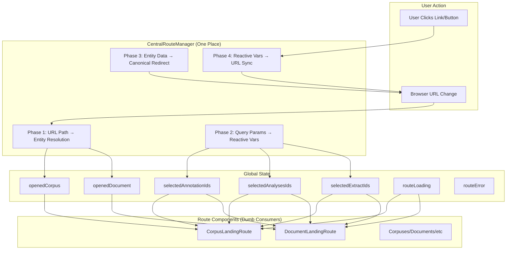

# OpenContracts Routing System Documentation

## Table of Contents

1. [Overview](#overview)
2. [Architecture](#architecture)
3. [Route Patterns](#route-patterns)
4. [CentralRouteManager](#centralroutemanager)
5. [Route Components](#route-components)
6. [State Management](#state-management)
7. [Navigation Utilities](#navigation-utilities)
8. [Testing](#testing)
9. [Best Practices](#best-practices)

## Overview

The OpenContracts routing system follows a **centralized architecture** where **one component rules them all**: `CentralRouteManager`. This component handles ALL URL ↔ State synchronization, entity fetching, and canonical redirects, while route components are simple consumers of global state.

### Key Principles

- **One Place to Rule Them All**: `CentralRouteManager` is the single source of truth for routing
- **Four-Phase Architecture**: Clean separation of URL parsing, query params, redirects, and sync
- **Explicit Routes**: Clear patterns with `/c/` and `/d/` prefixes eliminate ambiguity
- **Slug-First**: SEO-friendly URLs with automatic ID → slug redirection
- **Dumb Consumers**: Route components just read reactive vars and render
- **URL as Source of Truth**: No persistent state, URL drives everything
- **Centralized Query Params**: All `?ann=`, `?analysis=`, `?extract=` handled in one place

### The Critical Convention

**ONLY `CentralRouteManager` is allowed to SET the following reactive variables:**
- `openedCorpus()`
- `openedDocument()`

**ALL other components must ONLY READ these reactive variables using `useReactiveVar()`.**

This is non-negotiable. Violations cause infinite loops, route jittering, competing state updates, and unpredictable behavior. During development, we systematically removed all violations from:
- `CorpusDocumentCards.tsx` (caused infinite loop bug)
- `DocumentKnowledgeBase.tsx` (4 violations)
- `FloatingDocumentControls.tsx` (1 violation)
- `NavMenu.tsx` / `MobileNavMenu.tsx` (clearing on menu clicks)
- `CorpusBreadcrumbs.tsx` (manual clearing)
- `Corpuses.tsx` (3 violations)
- Deleted obsolete `RouteStateSync.ts` hook (14 violations)

**If you find yourself writing `openedCorpus(someValue)` or `openedDocument(someValue)` anywhere except `CentralRouteManager.tsx`, STOP. You are introducing a bug.**

### Design Decisions

**Why Centralized?**
- Previous scattered approach had URL parsing in 6+ locations
- Circular dependencies between components
- Duplicate entity fetching
- Difficult to maintain and test

**The Solution:**
- `CentralRouteManager` owns all routing logic (`src/routing/CentralRouteManager.tsx`)
- Route components are ~40 lines (was ~180 lines)
- Single GraphQL query per route
- Predictable state flow: URL → Manager → Reactive Vars → Components

## Architecture



### Four-Phase Flow

**Phase 1: URL Path → Entity Resolution** (`CentralRouteManager.tsx:116-330`)
- Parse pathname: `/c/john/corpus` → `{ type: "corpus", userIdent: "john", corpusIdent: "corpus" }`
- Detect entity routes vs browse routes
- Fetch entities via GraphQL (corpus/document)
- Set `openedCorpus`/`openedDocument` reactive vars
- Handle loading/error states

**Phase 2: URL Query Params → Reactive Vars** (`CentralRouteManager.tsx:332-347`)
- Extract `?ann=123,456` → `selectedAnnotationIds(["123", "456"])`
- Extract `?analysis=789` → `selectedAnalysesIds(["789"])`
- Extract `?extract=101` → `selectedExtractIds(["101"])`
- Centralized for ALL routes (corpus, document, browse)

**Phase 3: Entity Data → Canonical Redirects** (`CentralRouteManager.tsx:349-372`)
- Check if URL matches canonical slug path
- Redirect `/c/john/old-slug` → `/c/john-doe/normalized-slug`
- Preserve query parameters during redirect
- Ensure SEO-friendly URLs

**Phase 4: Reactive Vars → URL Sync** (`CentralRouteManager.tsx:374-407`)
- Watch reactive var changes (user selects annotation)
- Build query string: `ann=123&analysis=456`
- Update URL with `navigate({ search: queryString }, { replace: true })`
- Bidirectional: URL drives state, state updates URL

## Route Patterns

### Entity Routes (Full Object Fetching)

| Pattern                                 | Example                       | Component            | CentralRouteManager Action |
| --------------------------------------- | ----------------------------- | -------------------- | -------------------------- |
| `/c/:userIdent/:corpusIdent`           | `/c/john/my-corpus`           | CorpusLandingRoute   | Phase 1: Fetch corpus      |
| `/d/:userIdent/:docIdent`              | `/d/john/my-document`         | DocumentLandingRoute | Phase 1: Fetch document    |
| `/d/:userIdent/:corpusIdent/:docIdent` | `/d/john/corpus/doc`          | DocumentLandingRoute | Phase 1: Fetch both        |

### Browse Routes (Query Params Only)

| Pattern        | Example                    | Component    | CentralRouteManager Action    |
| -------------- | -------------------------- | ------------ | ----------------------------- |
| `/corpuses`    | `/corpuses?analysis=123`   | Corpuses     | Phase 2: Parse query params   |
| `/documents`   | `/documents`               | Documents    | Phase 2: Parse query params   |
| `/annotations` | `/annotations?ann=123,456` | Annotations  | Phase 2: Parse query params   |
| `/extracts`    | `/extracts?extract=789`    | Extracts     | Phase 2: Parse query params   |
| `/label_sets`  | `/label_sets`              | Labelsets    | No action (simple list view)  |

### Query Parameters (All Routes)

| Parameter    | Purpose                     | Example                           | Set By         |
| ------------ | --------------------------- | --------------------------------- | -------------- |
| `?ann=`      | Select annotations          | `?ann=123,456,789`                | Phase 2 or 4   |
| `?analysis=` | Select analyses             | `?analysis=123,456`               | Phase 2 or 4   |
| `?extract=`  | Select extracts             | `?extract=456,789`                | Phase 2 or 4   |

**Examples:**
```bash
# Corpus with selections
/c/john/legal-corpus?analysis=5678&extract=9012

# Document with annotation
/d/jane/contract?ann=1234

# Document in corpus with all params
/d/john/corpus/doc?ann=1,2&analysis=3&extract=4

# Browse with highlighting
/annotations?ann=123,456
```

### Route Configuration

**App.tsx** (lines 301-343):
```typescript
{/* CentralRouteManager handles ALL URL ↔ State sync */}
<CentralRouteManager />

<Routes>
  {/* Entity routes */}
  <Route path="/d/:userIdent/:corpusIdent/:docIdent" element={<DocumentLandingRoute />} />
  <Route path="/d/:userIdent/:docIdent" element={<DocumentLandingRoute />} />
  <Route path="/c/:userIdent/:corpusIdent" element={<CorpusLandingRoute />} />

  {/* Browse routes */}
  <Route path="/corpuses" element={<Corpuses />} />
  <Route path="/documents" element={<Documents />} />
  <Route path="/annotations" element={<Annotations />} />
  <Route path="/extracts" element={<Extracts />} />
  <Route path="/label_sets" element={<Labelsets />} />

  {/* 404 */}
  <Route path="/404" element={<NotFound />} />
  <Route path="*" element={<NotFound />} />
</Routes>
```

### ID-Based Navigation (Auto-Redirect)

CentralRouteManager automatically detects IDs and redirects to canonical slug URLs:

✅ `/c/john/Q29ycHVzOjEyMw==` → `/c/john-doe/my-corpus`
✅ `/d/jane/4567` → `/d/jane/my-document`
✅ `/d/john/corpus/7890` → `/d/john/corpus/doc-slug`

**Detection Logic** (`utils/navigationUtils.ts:getIdentifierType()`):
- Base64 strings (e.g., `Q29ycHVzOjEyMw==`)
- Numeric IDs ≥4 digits (e.g., `1234`, `456789`)
- GID format (e.g., `gid://app/Corpus/123`)

## CentralRouteManager

**Location:** `src/routing/CentralRouteManager.tsx`

### Core Responsibilities

1. **Parse URLs** → Determine route type (corpus/document/browse)
2. **Fetch Entities** → GraphQL queries for corpus/document
3. **Extract Query Params** → Parse `?ann=`, `?analysis=`, `?extract=`
4. **Set Global State** → Update reactive vars
5. **Canonical Redirects** → Ensure SEO-friendly URLs
6. **Bidirectional Sync** → Watch state changes, update URL

### Implementation Details

**Phase 1: Entity Resolution** (lines 116-330)
```typescript
useEffect(() => {
  const route = parseRoute(location.pathname);

  // Browse routes - clear entities
  if (route.type === "browse" || route.type === "unknown") {
    openedCorpus(null);
    openedDocument(null);
    routeLoading(false);
    return;
  }

  // Entity routes - fetch from GraphQL
  if (route.type === "corpus") {
    // RESOLVE_CORPUS_BY_SLUGS_FULL
    const { data } = await resolveCorpus({
      variables: { userSlug, corpusSlug }
    });
    openedCorpus(data.corpusBySlugs);
  }

  if (route.type === "document") {
    // RESOLVE_DOCUMENT_BY_SLUGS_FULL or
    // RESOLVE_DOCUMENT_IN_CORPUS_BY_SLUGS_FULL
    const { data } = await resolveDocument(...);
    openedDocument(data.documentBySlugs);
    openedCorpus(data.corpusBySlugs || null);
  }
}, [location.pathname]);
```

**Phase 2: Query Params** (lines 332-347)
```typescript
useEffect(() => {
  const annIds = parseQueryParam(searchParams.get("ann"));
  const analysisIds = parseQueryParam(searchParams.get("analysis"));
  const extractIds = parseQueryParam(searchParams.get("extract"));

  selectedAnnotationIds(annIds);
  selectedAnalysesIds(analysisIds);
  selectedExtractIds(extractIds);
}, [searchParams]);
```

**Phase 3: Canonical Redirects** (lines 349-372)
```typescript
useEffect(() => {
  const canonicalPath = buildCanonicalPath(document, corpus);
  if (canonicalPath && currentPath !== canonicalPath) {
    navigate(canonicalPath + location.search, { replace: true });
  }
}, [corpus, document, location.pathname]);
```

**Phase 4: URL Sync** (lines 374-407)
```typescript
useEffect(() => {
  const queryString = buildQueryParams({
    annotationIds: annIds,
    analysisIds,
    extractIds,
  });

  if (currentSearch !== queryString) {
    navigate({ search: queryString }, { replace: true });
  }
}, [annIds, analysisIds, extractIds]);
```

### GraphQL Queries

**Corpus Resolution** (`src/graphql/queries.ts:RESOLVE_CORPUS_BY_SLUGS_FULL`):
```graphql
query ResolveCorpusBySlugsFull($userSlug: String!, $corpusSlug: String!) {
  corpusBySlugs(userSlug: $userSlug, corpusSlug: $corpusSlug) {
    id
    slug
    title
    description
    creator { id username slug }
    labelSet { id title }
    myPermissions
    isPublic
  }
}
```

**Document Resolution** (`src/graphql/queries.ts:RESOLVE_DOCUMENT_BY_SLUGS_FULL`):
```graphql
query ResolveDocumentBySlugsFull($userSlug: String!, $documentSlug: String!) {
  documentBySlugs(userSlug: $userSlug, documentSlug: $documentSlug) {
    id
    slug
    title
    description
    creator { id username slug }
    corpus { id slug title creator { id slug } }
    pdfFile { id url }
  }
}
```

**Document in Corpus** (`src/graphql/queries.ts:RESOLVE_DOCUMENT_IN_CORPUS_BY_SLUGS_FULL`):
```graphql
query ResolveDocumentInCorpusBySlugsFull(
  $userSlug: String!
  $corpusSlug: String!
  $documentSlug: String!
) {
  corpusBySlugs(userSlug: $userSlug, corpusSlug: $corpusSlug) { ... }
  documentInCorpusBySlugs(
    userSlug: $userSlug
    corpusSlug: $corpusSlug
    documentSlug: $documentSlug
  ) { ... }
}
```

### Performance Optimizations

**Request Deduplication** (`utils/performanceMonitoring.ts:RequestTracker`):
```typescript
// Prevents duplicate simultaneous requests
if (requestTracker.isPending(requestKey)) {
  return; // Skip duplicate request
}

await requestTracker.trackRequest(requestKey, async () => {
  // Perform GraphQL query
});
```

**Route Processing Guard** (line 120-123):
```typescript
// Skip if we've already processed this exact path
if (lastProcessedPath.current === currentPath) {
  return;
}
lastProcessedPath.current = currentPath;
```

**Apollo Cache**:
```typescript
fetchPolicy: "cache-first"
nextFetchPolicy: "cache-and-network"
```

## Route Components

Route components are now **dumb consumers** that read reactive vars and render UI.

### DocumentLandingRoute

**Location:** `src/components/routes/DocumentLandingRoute.tsx` (48 lines, was 180)

```typescript
export const DocumentLandingRoute: React.FC = () => {
  const navigate = useNavigate();

  // Just read state from reactive vars (set by CentralRouteManager)
  const document = useReactiveVar(openedDocument);
  const corpus = useReactiveVar(openedCorpus);
  const loading = useReactiveVar(routeLoading);
  const error = useReactiveVar(routeError);

  // Loading/error states
  if (loading) return <ModernLoadingDisplay type="document" />;
  if (error || !document) return <ModernErrorDisplay error={error} />;

  // Close handler
  const handleClose = () => {
    if (corpus) {
      navigate(`/c/${corpus.creator.slug}/${corpus.slug}`);
    } else {
      navigate("/documents");
    }
  };

  // Just render with hydrated data
  return (
    <ErrorBoundary>
      <MetaTags title={document.title} type="document" />
      <DocumentKnowledgeBase
        documentId={document.id}
        corpusId={corpus?.id}
        onClose={handleClose}
      />
    </ErrorBoundary>
  );
};
```

**Key Points:**
- No `useParams()` → CentralRouteManager owns URL parsing
- No GraphQL queries → CentralRouteManager fetches entities
- No URL sync → CentralRouteManager handles query params
- Just reads `openedDocument`, `openedCorpus`, `routeLoading`, `routeError`
- Pure view logic

### CorpusLandingRoute

**Location:** `src/components/routes/CorpusLandingRoute.tsx` (42 lines, was 120)

```typescript
export const CorpusLandingRoute: React.FC = () => {
  const corpus = useReactiveVar(openedCorpus);
  const loading = useReactiveVar(routeLoading);
  const error = useReactiveVar(routeError);

  if (loading) return <ModernLoadingDisplay type="corpus" />;
  if (error || !corpus) return <ModernErrorDisplay error={error} />;

  return (
    <ErrorBoundary>
      <MetaTags title={corpus.title} type="corpus" />
      <Corpuses />
    </ErrorBoundary>
  );
};
```

### Browse Views (Corpuses, Documents, Annotations, Extracts)

**Example:** `src/views/Annotations.tsx`

```typescript
export const Annotations = () => {
  // URL query parameters already set by CentralRouteManager
  const annotation_ids = useReactiveVar(selectedAnnotationIds);
  const analysis_ids = useReactiveVar(selectedAnalysesIds);

  // Just consume the state and render
  return <AnnotationCards />;
};
```

**What They DON'T Do:**
- ❌ No `useParams()` extraction
- ❌ No entity fetching by route
- ❌ No URL query param parsing
- ❌ No canonical redirects

**What They DO:**
- ✅ Read reactive vars
- ✅ Fetch lists (not entities)
- ✅ Display UI
- ✅ Update selections (which CentralRouteManager syncs to URL)

## State Management

### Global Reactive Variables

**Location:** `src/graphql/cache.ts`

```typescript
// Entity state (set by CentralRouteManager Phase 1)
export const openedCorpus = makeVar<CorpusType | null>(null);
export const openedDocument = makeVar<DocumentType | null>(null);

// Selection state (set by CentralRouteManager Phase 2, watched by Phase 4)
export const selectedAnnotationIds = makeVar<string[]>([]);
export const selectedAnalysesIds = makeVar<string[]>([]);
export const selectedExtractIds = makeVar<string[]>([]);

// Loading/error state (set by CentralRouteManager Phase 1)
export const routeLoading = makeVar<boolean>(false);
export const routeError = makeVar<Error | null>(null);
```

### State Flow

```
┌─────────────────────────────────────────────────────────────┐
│ URL: /c/john/my-corpus?analysis=123&extract=456            │
└─────────────────────────────────────────────────────────────┘
                          ↓
          ┌───────────────────────────┐
          │   CentralRouteManager     │
          │  (One Place to Rule All)  │
          └───────────────────────────┘
                    ↓           ↓
         ┌──────────────┐  ┌──────────────────────┐
         │ Phase 1      │  │ Phase 2              │
         │ Parse path   │  │ Parse query params   │
         │ Fetch corpus │  │ ?analysis=123        │
         └──────────────┘  │ ?extract=456         │
                ↓          └──────────────────────┘
    ┌───────────────────┐           ↓
    │ openedCorpus      │  ┌────────────────────────┐
    │ = CorpusType      │  │ selectedAnalysesIds    │
    │                   │  │ = ["123"]              │
    │ routeLoading      │  │                        │
    │ = false           │  │ selectedExtractIds     │
    └───────────────────┘  │ = ["456"]              │
                ↓          └────────────────────────┘
        ┌─────────────────────────┐
        │  CorpusLandingRoute     │
        │  (Dumb Consumer)        │
        │                         │
        │  const corpus =         │
        │    useReactiveVar(      │
        │      openedCorpus       │
        │    );                   │
        │                         │
        │  return <Corpuses />    │
        └─────────────────────────┘
                    ↓
            ┌──────────────┐
            │  Corpuses    │
            │  View        │
            │  Renders!    │
            └──────────────┘
```

### Bidirectional Sync Example

**User selects annotation → URL updates:**
```typescript
// Component updates reactive var
selectedAnnotationIds(["123", "456"]);

// CentralRouteManager Phase 4 watches reactive vars
useEffect(() => {
  const queryString = buildQueryParams({ annotationIds: annIds, ... });
  navigate({ search: queryString }, { replace: true });
}, [annIds]);

// URL becomes: ?ann=123,456
```

**URL changes → Component updates:**
```typescript
// CentralRouteManager Phase 2 watches URL
useEffect(() => {
  const annIds = parseQueryParam(searchParams.get("ann"));
  selectedAnnotationIds(annIds); // ["123", "456"]
}, [searchParams]);

// Component reads reactive var
const annotation_ids = useReactiveVar(selectedAnnotationIds);
// Renders with: ["123", "456"]
```

## Navigation Utilities

**Location:** `src/utils/navigationUtils.ts`

### Core Functions

**parseRoute()** - Parse URL pathname
```typescript
parseRoute("/c/john/my-corpus")
// Returns: { type: "corpus", userIdent: "john", corpusIdent: "my-corpus" }

parseRoute("/d/john/corpus/doc")
// Returns: { type: "document", userIdent: "john",
//           corpusIdent: "corpus", documentIdent: "doc" }

parseRoute("/annotations")
// Returns: { type: "browse", browsePath: "annotations" }
```

**parseQueryParam()** - Parse comma-separated IDs
```typescript
parseQueryParam("123,456,789")
// Returns: ["123", "456", "789"]

parseQueryParam(null)
// Returns: []
```

**buildCanonicalPath()** - Build SEO-friendly path
```typescript
buildCanonicalPath(document, corpus)
// Returns: "/d/john-doe/my-corpus/doc-slug"

buildCanonicalPath(document, null)
// Returns: "/d/jane/standalone-doc"

buildCanonicalPath(null, corpus)
// Returns: "/c/john/my-corpus"
```

**buildQueryParams()** - Build query string
```typescript
buildQueryParams({
  annotationIds: ["1", "2"],
  analysisIds: ["3"],
  extractIds: ["4"]
})
// Returns: "?ann=1,2&analysis=3&extract=4"
```

### Navigation Functions

**getCorpusUrl()** - Generate corpus URL
```typescript
getCorpusUrl(corpus)
// Returns: "/c/john/my-corpus"

getCorpusUrl(corpus, { analysisIds: ["123"] })
// Returns: "/c/john/my-corpus?analysis=123"

getCorpusUrl({ id: "1", slug: "" }) // Missing slug
// Returns: "#" (safe fallback)
```

**getDocumentUrl()** - Generate document URL
```typescript
getDocumentUrl(document, corpus)
// Returns: "/d/john/corpus/doc"

getDocumentUrl(document, null)
// Returns: "/d/jane/standalone-doc"

getDocumentUrl(document, corpus, {
  annotationIds: ["1"],
  analysisIds: ["2"],
  extractIds: ["3"]
})
// Returns: "/d/john/corpus/doc?ann=1&analysis=2&extract=3"
```

**navigateToCorpus()** - Smart corpus navigation
```typescript
navigateToCorpus(corpus, navigate, currentPath)
// Only navigates if not already there

navigateToCorpus(corpus, navigate, currentPath, { analysisIds: ["123"] })
// Navigates with query params
```

**navigateToDocument()** - Smart document navigation
```typescript
navigateToDocument(document, corpus, navigate, currentPath)
// Only navigates if not already there

navigateToDocument(document, corpus, navigate, currentPath, {
  annotationIds: ["456"]
})
// Navigates with query params
```

### Usage in Components

```typescript
// Card component
const handleClick = () => {
  const url = getDocumentUrl(document, corpus, {
    annotationIds: [annotation.id]
  });
  if (url !== "#") {
    navigate(url);
  }
};

// Smart navigation (checks if already there)
const handleNavigate = () => {
  navigateToDocument(document, corpus, navigate, location.pathname, {
    annotationIds: selectedAnnotationIds(),
    analysisIds: selectedAnalysesIds()
  });
};
```

## Testing

### Unit Tests

**navigationUtils.test.ts** (74 tests):
```typescript
describe("parseRoute()", () => {
  it("should parse corpus route", () => {
    expect(parseRoute("/c/john/my-corpus")).toEqual({
      type: "corpus",
      userIdent: "john",
      corpusIdent: "my-corpus"
    });
  });

  it("should parse browse routes", () => {
    expect(parseRoute("/annotations")).toEqual({
      type: "browse",
      browsePath: "annotations"
    });
  });
});

describe("buildQueryParams()", () => {
  it("should build query string", () => {
    expect(buildQueryParams({
      annotationIds: ["1", "2"],
      analysisIds: ["3"]
    })).toBe("?ann=1,2&analysis=3");
  });
});
```

### Integration Tests

**CentralRouteManager.test.tsx** (21 tests, 500+ lines):
```typescript
describe("Phase 1: URL Path → Entity Resolution", () => {
  it("should resolve corpus from slug-based URL", async () => {
    const mocks = [/* GraphQL mock */];

    render(
      <MockedProvider mocks={mocks}>
        <MemoryRouter initialEntries={["/c/john/my-corpus"]}>
          <CentralRouteManager />
        </MemoryRouter>
      </MockedProvider>
    );

    expect(routeLoading()).toBe(true);
    await waitFor(() => expect(routeLoading()).toBe(false));
    expect(openedCorpus()).toEqual(mockCorpus);
  });
});

describe("Phase 2: Query Params → Reactive Vars", () => {
  it("should parse annotation IDs from URL", () => {
    render(
      <MemoryRouter initialEntries={["/annotations?ann=123,456"]}>
        <CentralRouteManager />
      </MemoryRouter>
    );

    expect(selectedAnnotationIds()).toEqual(["123", "456"]);
  });
});

describe("Phase 4: Reactive Vars → URL Sync", () => {
  it("should update URL when annotation IDs change", async () => {
    render(<CentralRouteManager />);

    selectedAnnotationIds(["new-123"]);

    await waitFor(() => {
      expect(mockNavigate).toHaveBeenCalledWith(
        { search: "ann=new-123" },
        { replace: true }
      );
    });
  });
});
```

**routing-integration.test.tsx** (7 full-flow tests):
```typescript
it("should flow from URL → Manager → Reactive Vars → Component", async () => {
  const mocks = [/* corpus mock */];

  render(
    <MockedProvider mocks={mocks}>
      <MemoryRouter initialEntries={["/c/john/my-corpus?analysis=123"]}>
        <CentralRouteManager />
        <Routes>
          <Route path="/c/:userIdent/:corpusIdent" element={<CorpusLandingRoute />} />
        </Routes>
      </MemoryRouter>
    </MockedProvider>
  );

  // Phase 1: Loading
  expect(routeLoading()).toBe(true);

  // Phase 2: Wait for resolution
  await waitFor(() => expect(routeLoading()).toBe(false));

  // Phase 3: Verify reactive vars
  expect(openedCorpus()).toEqual(mockCorpus);
  expect(selectedAnalysesIds()).toEqual(["123"]);

  // Phase 4: Verify component rendered
  expect(screen.getByTestId("corpus-view")).toBeInTheDocument();
});
```

### Route Component Tests

**DocumentLandingRoute.test.tsx** (6 tests):
```typescript
describe("State-Driven Rendering", () => {
  beforeEach(() => {
    openedDocument(null);
    routeLoading(false);
    routeError(null);
  });

  it("should show loading when routeLoading is true", () => {
    routeLoading(true);
    render(<DocumentLandingRoute />);
    expect(screen.getByText("Loading...")).toBeInTheDocument();
  });

  it("should render view when document is loaded", () => {
    openedDocument(mockDocument);
    routeLoading(false);
    render(<DocumentLandingRoute />);
    expect(screen.getByText("DocumentKnowledgeBase")).toBeInTheDocument();
  });
});
```

## Best Practices

### Critical Rules (MUST Follow)

**🚨 RULE #1: NEVER Set `openedCorpus` or `openedDocument` Outside CentralRouteManager**

```typescript
// ❌ NEVER DO THIS (anywhere except CentralRouteManager.tsx):
openedCorpus(someCorpus);
openedDocument(someDocument);
openedCorpus(null);
openedDocument(null);

// ✅ ALWAYS DO THIS:
const corpus = useReactiveVar(openedCorpus);  // Read only
const document = useReactiveVar(openedDocument);  // Read only
```

**Why?** Setting these vars from multiple places creates competing state updates, infinite loops, and route jittering. We learned this the hard way when `CorpusDocumentCards.tsx` was fetching corpus data and setting `openedCorpus()`, creating an infinite loop with `CentralRouteManager`.

**🚨 RULE #2: NEVER Fetch Entities in Route Components**

```typescript
// ❌ NEVER DO THIS in route components:
const { data } = useQuery(GET_CORPUS_BY_ID, {
  onCompleted: (data) => {
    openedCorpus(data.corpus);  // VIOLATION!
  }
});

// ✅ CentralRouteManager handles ALL entity fetching:
// - Corpus resolution via RESOLVE_CORPUS_BY_SLUGS_FULL
// - Document resolution via RESOLVE_DOCUMENT_BY_SLUGS_FULL
// - Automatic caching and deduplication
```

**Why?** Duplicate fetching wastes bandwidth, creates race conditions, and makes caching impossible. Let CentralRouteManager do its job.

**🚨 RULE #3: NEVER Parse Route Parameters Outside CentralRouteManager**

```typescript
// ❌ NEVER DO THIS:
const { userIdent, corpusIdent } = useParams();
// Parse URL yourself...

// ✅ ALWAYS DO THIS:
const corpus = useReactiveVar(openedCorpus);
// CentralRouteManager already parsed the URL and fetched the corpus
```

**Why?** URL parsing logic should exist in exactly one place. Multiple parsers lead to inconsistencies and bugs.

**🚨 RULE #4: NEVER Manually Clear Route State**

```typescript
// ❌ NEVER DO THIS:
const gotoHome = () => {
  openedCorpus(null);  // VIOLATION!
  openedDocument(null);  // VIOLATION!
  navigate("/corpuses");
};

// ✅ ALWAYS DO THIS:
const gotoHome = () => {
  navigate("/corpuses");
  // CentralRouteManager will detect the route change and clear state automatically
};
```

**Why?** CentralRouteManager watches the URL and automatically clears `openedCorpus`/`openedDocument` when navigating to browse routes. Manual clearing creates race conditions.

### DO ✅

**Routing:**
- ✅ Let CentralRouteManager handle ALL URL ↔ State sync
- ✅ Route components just read reactive vars with `useReactiveVar()`
- ✅ Use navigation utilities (`getCorpusUrl`, `getDocumentUrl`, etc.)
- ✅ Preserve query params when navigating
- ✅ Check for `"#"` return from URL generators (indicates missing data)
- ✅ Trust that CentralRouteManager will clear state when routes change

**State:**
- ✅ URL is source of truth (no persistent local state)
- ✅ Read entity vars: `const corpus = useReactiveVar(openedCorpus);`
- ✅ Update selection vars: `selectedAnnotationIds(["123"]);`
- ✅ Let Phase 4 sync selection changes → URL automatically
- ✅ Check `routeLoading` before accessing entities
- ✅ Handle `routeError` for failed entity resolution

**Navigation:**
- ✅ Use `getCorpusUrl(corpus)` to generate URLs
- ✅ Use `getDocumentUrl(document, corpus)` with optional query params
- ✅ Use `navigateToCorpus()` / `navigateToDocument()` for smart navigation (checks if already there)
- ✅ Pass current path to smart navigation functions
- ✅ Include query params to preserve user selections

**Component Architecture:**
- ✅ Route components are < 50 lines (just read state and render)
- ✅ View components consume reactive vars for selections
- ✅ Card components use navigation utilities
- ✅ Modal components read corpus/document context from reactive vars

**Testing:**
- ✅ Test CentralRouteManager phases independently
- ✅ Test route components as dumb consumers (mock reactive vars)
- ✅ Test full integration flow (URL → Manager → Component)
- ✅ In tests, you CAN set reactive vars directly for setup

### DON'T ❌

**Routing (CRITICAL - These cause bugs):**
- ❌ NEVER set `openedCorpus()` or `openedDocument()` outside CentralRouteManager
- ❌ NEVER parse URLs with `useParams()` in route components or views
- ❌ NEVER fetch corpus/document entities in route components
- ❌ NEVER manually clear `openedCorpus(null)` or `openedDocument(null)` on navigation
- ❌ NEVER add routing logic outside CentralRouteManager
- ❌ NEVER sync reactive vars to URL manually (Phase 4 does this)

**State:**
- ❌ Don't persist routing state in localStorage/sessionStorage
- ❌ Don't assume entities are loaded (always check `routeLoading` and handle null)
- ❌ Don't ignore `routeError` (display error state)
- ❌ Don't set entity reactive vars from `onCompleted` handlers

**Navigation:**
- ❌ Don't navigate without checking URL validity (check for `"#"` return)
- ❌ Don't assume slugs exist (use `getCorpusUrl()` which handles missing slugs)
- ❌ Don't hardcode URLs (use navigation utilities)
- ❌ Don't drop query params (loses user selections)
- ❌ Don't use raw IDs in URLs (they auto-redirect to slugs anyway)

### Code Examples

**❌ WRONG - Scattered URL parsing:**
```typescript
// Old approach (DELETED)
const { userIdent, corpusIdent } = useParams();
const [resolveCorpus] = useLazyQuery(RESOLVE_CORPUS);

useEffect(() => {
  resolveCorpus({ variables: { userSlug: userIdent, corpusSlug: corpusIdent } });
}, [userIdent, corpusIdent]);
```

**✅ CORRECT - Centralized:**
```typescript
// Route component (simple consumer)
export const CorpusLandingRoute = () => {
  const corpus = useReactiveVar(openedCorpus);
  const loading = useReactiveVar(routeLoading);

  if (loading) return <Loading />;
  return <Corpuses />;
};

// CentralRouteManager handles everything
```

**❌ WRONG - Manual URL sync:**
```typescript
// Old approach (DELETED)
useEffect(() => {
  const queryString = annotationIds.join(",");
  navigate(`?ann=${queryString}`);
}, [annotationIds]);
```

**✅ CORRECT - Automatic sync:**
```typescript
// Just update reactive var
selectedAnnotationIds(["123", "456"]);

// CentralRouteManager Phase 4 watches and syncs to URL automatically
```

## Component Ecosystem

The routing system coordinates multiple components that work together. Understanding their roles and dependencies is critical.

### Core Components

**CentralRouteManager** (`src/routing/CentralRouteManager.tsx`)
- **Role**: The ONLY component that sets `openedCorpus` and `openedDocument`
- **Responsibilities**: URL parsing, entity fetching, canonical redirects, query param sync
- **Dependencies**: None (it's the source of truth)
- **Used by**: All route components and views (indirectly via reactive vars)

**CorpusLandingRoute** (`src/components/routes/CorpusLandingRoute.tsx`)
- **Role**: Dumb consumer for corpus entity routes (`/c/:user/:corpus`)
- **Reads**: `openedCorpus`, `routeLoading`, `routeError`
- **Never Sets**: Any reactive vars
- **Renders**: `<Corpuses />` view when corpus is loaded

**DocumentLandingRoute** (`src/components/routes/DocumentLandingRoute.tsx`)
- **Role**: Dumb consumer for document entity routes (`/d/:user/:doc`)
- **Reads**: `openedDocument`, `openedCorpus`, `routeLoading`, `routeError`
- **Never Sets**: Any reactive vars
- **Renders**: `<DocumentKnowledgeBase />` when document is loaded

### View Components

**Corpuses** (`src/views/Corpuses.tsx`)
- **Role**: Main corpus list/detail view
- **Reads**: `openedCorpus`, `selectedAnalysesIds`, `selectedExtractIds`
- **Never Sets**: `openedCorpus` (CentralRouteManager owns this)
- **Can Set**: Selection vars like `selectedAnalysesIds()` (Phase 4 syncs to URL)
- **Queries**: Fetches corpus LIST data, NOT entity data by route

**Documents** (`src/views/Documents.tsx`)
- **Role**: Document list view
- **Reads**: `openedDocument`, selection vars
- **Never Sets**: Entity vars
- **Queries**: Document lists, not route entities

**Annotations** (`src/views/Annotations.tsx`)
- **Role**: Annotation browse view
- **Reads**: `selectedAnnotationIds`, `selectedAnalysesIds`
- **Never Sets**: Entity vars
- **Uses**: Query params set by CentralRouteManager Phase 2

**Extracts** (`src/views/Extracts.tsx`)
- **Role**: Extract browse view
- **Reads**: `selectedExtractIds`, context from `openedCorpus`/`openedDocument`
- **Never Sets**: Entity vars
- **Uses**: Query params set by CentralRouteManager Phase 2

### Card Components

**CorpusDocumentCards** (`src/components/documents/CorpusDocumentCards.tsx`)
- **Role**: Display documents in a corpus
- **Reads**: `openedCorpus` for context (e.g., file uploads)
- **Never Sets**: `openedCorpus` ⚠️ This caused the infinite loop bug!
- **Navigation**: Uses `navigateToDocument()` utility
- **Previous Bug**: Was fetching corpus and setting `openedCorpus()` in `onCompleted`

**DocumentItem** (`src/components/documents/DocumentItem.tsx`)
- **Role**: Individual document card
- **Reads**: `openedCorpus()` for context
- **Never Sets**: Any entity vars
- **Navigation**: Uses `navigateToDocument(document, corpus, navigate, path)`

**AnnotationCards** (`src/components/annotations/AnnotationCards.tsx`)
- **Role**: Display annotation list
- **Updates**: `selectedAnnotationIds()` when user selects (Phase 4 syncs to URL)
- **Reads**: Context from `openedCorpus`/`openedDocument`

**ExtractCards** (`src/components/extracts/ExtractCards.tsx`)
- **Role**: Display extract list
- **Updates**: `selectedExtractIds()` when user selects
- **Reads**: Context from entity vars

**AnalysesCards** (`src/components/analyses/AnalysesCards.tsx`)
- **Role**: Display analysis list
- **Updates**: `selectedAnalysesIds()` when user selects
- **Reads**: Context from entity vars

### Knowledge Base Components

**DocumentKnowledgeBase** (`src/components/knowledge_base/document/DocumentKnowledgeBase.tsx`)
- **Role**: Main document viewer with PDF, annotations, etc.
- **Reads**: `openedDocument`, `openedCorpus` for rendering
- **Never Sets**: These vars ⚠️ Had 4 violations removed (lines 658, 661, 1365, 1899)
- **Receives**: `documentId` and `corpusId` as props from route component
- **Previous Violations**: Was setting entities in query `onCompleted` handlers and cleanup effects

**FloatingDocumentControls** (`src/components/knowledge_base/document/FloatingDocumentControls.tsx`)
- **Role**: Toolbar for document actions (analysis, export, etc.)
- **Reads**: `openedCorpus()` for context
- **Never Sets**: Entity vars ⚠️ Had 1 violation removed (line 652)
- **Uses**: Jotai atom `corpusStateAtom` for component-local state (this is fine)
- **Previous Violation**: Was setting `openedCorpus(selectedCorpus)` before opening modal

### Navigation Components

**NavMenu** (`src/components/layout/NavMenu.tsx`)
- **Role**: Desktop top navigation
- **Reads**: `openedCorpus`, `openedDocument` (only for display, not actively used)
- **Never Sets**: Entity vars ⚠️ Had violations removed
- **Navigation**: Just calls `navigate()` - CentralRouteManager clears state
- **Previous Violation**: Had `clearSelections()` function that set vars to null

**MobileNavMenu** (`src/components/layout/MobileNavMenu.tsx`)
- **Role**: Mobile hamburger navigation
- **Reads**: Entity vars (not actively used)
- **Never Sets**: Entity vars ⚠️ Had violations removed
- **Navigation**: Just calls `navigate()` like NavMenu

**CorpusBreadcrumbs** (`src/components/corpuses/CorpusBreadcrumbs.tsx`)
- **Role**: Display breadcrumb navigation (Corpuses > Corpus > Document)
- **Reads**: `openedCorpus`, `openedDocument` for display
- **Never Sets**: Entity vars ⚠️ Had violations removed
- **Navigation**: Uses `navigateToCorpus()` utility
- **Previous Violation**: Was manually clearing vars in `gotoHome()`

### Data Flow: How Components Work Together

```
1. User clicks link
        ↓
2. Browser URL changes to /c/john/my-corpus?analysis=123
        ↓
3. CentralRouteManager detects URL change
        ↓
4. Phase 1: Parse path → Fetch corpus → Set openedCorpus(data)
   Phase 2: Parse query → Set selectedAnalysesIds(["123"])
        ↓
5. Reactive var changes trigger re-renders
        ↓
6. CorpusLandingRoute reads openedCorpus → Renders <Corpuses />
        ↓
7. Corpuses reads openedCorpus, selectedAnalysesIds → Renders UI
        ↓
8. User clicks analysis in AnalysesCards
        ↓
9. Component updates: selectedAnalysesIds(["456"])
        ↓
10. Phase 4: CentralRouteManager detects change → Updates URL to ?analysis=456
        ↓
11. Cycle continues...
```

### Common Patterns

**Pattern 1: Card Component Navigating**
```typescript
// In DocumentItem.tsx, AnnotationCard.tsx, etc.
const handleClick = () => {
  const corpus = openedCorpus();  // Read for context
  navigateToDocument(document, corpus, navigate, location.pathname);
  // CentralRouteManager will detect URL change and set openedDocument()
};
```

**Pattern 2: View Component Reading Selections**
```typescript
// In Annotations.tsx, Extracts.tsx, etc.
const annotation_ids = useReactiveVar(selectedAnnotationIds);
const corpus = useReactiveVar(openedCorpus);  // Context only

// Render with this data
return <AnnotationCards selectedIds={annotation_ids} />;
```

**Pattern 3: Route Component Delegating**
```typescript
// In DocumentLandingRoute.tsx, CorpusLandingRoute.tsx
const document = useReactiveVar(openedDocument);
const loading = useReactiveVar(routeLoading);

if (loading) return <Loading />;
return <DocumentKnowledgeBase documentId={document.id} />;
// No fetching, no URL parsing, just read and render
```

**Pattern 4: Navigation Without State Manipulation**
```typescript
// In NavMenu.tsx, CorpusBreadcrumbs.tsx, etc.
const handleNavigate = () => {
  navigate("/corpuses");
  // DON'T set openedCorpus(null) - CentralRouteManager handles this
};
```

### Key Relationships

**CentralRouteManager ← → Reactive Vars ← → All Components**
- CentralRouteManager is the ONLY writer of `openedCorpus`/`openedDocument`
- All other components are readers via `useReactiveVar()`
- Selection vars can be updated by views/cards (Phase 4 syncs to URL)

**Route Components → View Components**
- Route components just delegate to views after checking loading/error
- Views don't know about routes, just consume reactive vars

**View Components → Card Components**
- Views orchestrate layout and pass data
- Cards handle interactions and navigation
- Cards use navigation utilities, never raw URLs

**CentralRouteManager → Navigation Utilities**
- CentralRouteManager uses `parseRoute()`, `buildCanonicalPath()`, etc.
- Components use `getCorpusUrl()`, `navigateToDocument()`, etc.
- Shared utilities ensure consistency

## Summary

The OpenContracts routing system follows the principle: **One Place to Rule Them All**.

### The Core Mantra

**ONLY `CentralRouteManager` sets `openedCorpus` and `openedDocument`.**

All other components READ ONLY via `useReactiveVar()`. Violations cause bugs.

### Architecture Overview

**CentralRouteManager** (`src/routing/CentralRouteManager.tsx`):
- 🎯 Single source of truth for ALL routing logic
- 📍 4-phase architecture: Parse → Query → Redirect → Sync
- 🔄 Bidirectional URL ↔ State synchronization
- 🚀 Automatic canonical redirects (ID → slug)
- ⚡ Request deduplication and caching
- 🎭 Enables route components to be ~40 lines (was ~180)

**Route Components** (CorpusLandingRoute, DocumentLandingRoute):
- Read reactive vars with `useReactiveVar()`
- Handle loading/error states
- Delegate to view components
- NEVER fetch entities or parse URLs

**View Components** (Corpuses, Documents, Annotations, Extracts):
- Consume reactive vars for entity context
- Update selection reactive vars (Phase 4 syncs to URL)
- Fetch list data (not route entities)
- Use navigation utilities for links

**Card Components** (DocumentItem, AnnotationCards, etc.):
- Use `getCorpusUrl()` / `getDocumentUrl()` for links
- Use `navigateToCorpus()` / `navigateToDocument()` for smart navigation
- Read entity vars for context only
- NEVER set entity vars

### Key Benefits

- ✨ **Simple**: Predictable unidirectional flow (URL → Manager → Vars → UI)
- 🧪 **Testable**: Phases isolated, components are dumb consumers
- 🔧 **Maintainable**: One place to change routing logic
- 🐛 **Reliable**: No circular dependencies, race conditions, or competing updates
- 📚 **Clear**: Explicit architecture with documented patterns
- 🚀 **Performant**: Request deduplication, caching, smart navigation

### Critical Rules (Remember These!)

1. **NEVER** set `openedCorpus()` or `openedDocument()` outside CentralRouteManager
2. **NEVER** fetch corpus/document entities in route components
3. **NEVER** parse URLs with `useParams()` in components/views
4. **NEVER** manually clear entity vars on navigation
5. **ALWAYS** use navigation utilities (`getCorpusUrl`, `navigateToDocument`, etc.)
6. **ALWAYS** check `routeLoading` before accessing entities
7. **ALWAYS** preserve query params when navigating

### When You Need To...

**Add a new entity type route:**
1. Add GraphQL resolver query to `queries.ts`
2. Add parsing logic to `parseRoute()` in `navigationUtils.ts`
3. Add fetch logic to CentralRouteManager Phase 1
4. Add reactive var to `cache.ts`
5. Create dumb route component that reads the var
6. Add route to `App.tsx`

**Add a new query parameter:**
1. Add reactive var to `cache.ts`
2. Add parsing in CentralRouteManager Phase 2
3. Add syncing in CentralRouteManager Phase 4
4. Update `buildQueryParams()` in `navigationUtils.ts`

**Debug a routing issue:**
1. Check CentralRouteManager console logs
2. Verify reactive vars are set correctly
3. Confirm component is reading vars with `useReactiveVar()`
4. Ensure no components are SETTING entity vars (use grep)
5. Check that navigation utilities are being used

### The Golden Rule

**When in doubt, read the code in `CentralRouteManager.tsx`.**

It's the single source of truth. If routing behavior seems wrong, the fix goes there. If a component needs routing data, it reads reactive vars. If you're writing `openedCorpus(...)` outside CentralRouteManager, you're doing it wrong.

---

**This architecture doesn't suck because it's simple, testable, and maintainable. Keep it that way.**
