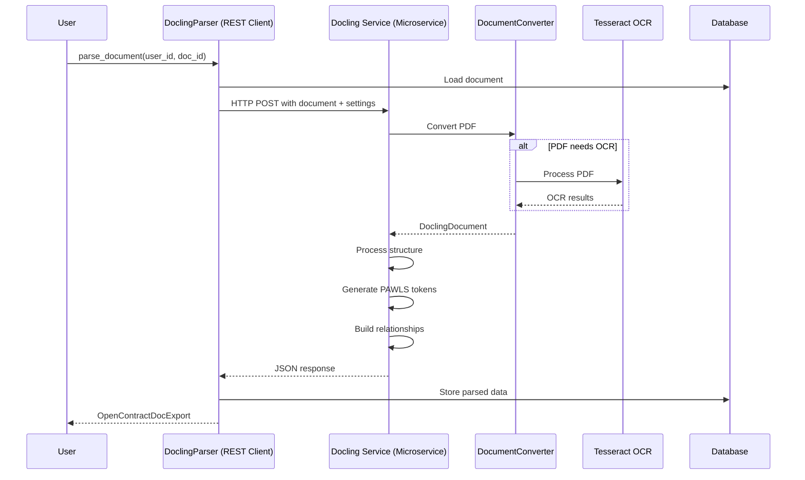

# Docling Parser (REST API)

## Intro

The Docling Parser is an advanced PDF document parser based on IBM's [docling](https://github.com/DS4SD/docling) document processing pipeline. As of `3.0.0-alpha1`, it is the primary parser for PDF documents in OpenContracts. The parser runs as a microservice and is accessed via REST API, providing better dependency isolation and scalability.

Perhaps its coolest feature, besides its ability to support multiple cutting-edge OCR engines and numerous formats, is its ability to group document features into groups. We've found this to be particularly useful for contract layouts and setup our Docling integration to import these groups as OpenContract "relationships" - which, if you're not familiar, map N source annotations to N target annotations. In the case of the Docling parser, these look like this (AWESOME):

.png)

## Architecture



## Features

- **Microservice Architecture**: Runs Docling in an isolated container for better dependency management
- **Intelligent OCR**: Automatically detects when OCR is needed
- **Hierarchical Structure**: Extracts document structure (headings, paragraphs, lists)
- **Token-based Annotations**: Creates precise token-level annotations
- **Relationship Detection**: Builds relationships between document elements
- **PAWLS Integration**: Generates PAWLS-compatible token data
- **Async Processing**: Non-blocking REST API calls with configurable timeouts

## Configuration

The Docling Parser is configured through Django settings:

```python
# Configure the parser in settings
INSTALLED_PARSERS = [
    "opencontractserver.pipeline.parsers.docling_parser_rest.DoclingParser",
]

# Configure the Docling microservice URL
DOCLING_PARSER_SERVICE_URL = "http://docling-parser:8000/parse/"

# Configure request timeout (in seconds)
DOCLING_PARSER_TIMEOUT = 300  # 5 minutes default

# Optional: Enable OCR for scanned documents
DOCLING_ENABLE_OCR = True

# The microservice itself needs models path configured via environment
# DOCLING_MODELS_PATH = "/models/docling"
```

## Microservice Setup

The Docling microservice runs in a separate Docker container:

```yaml
# docker-compose.yml
services:
  docling-parser:
    image: opencontracts/docling-parser:latest
    ports:
      - "8000:8000"
    environment:
      - DOCLING_MODELS_PATH=/models/docling
      - ENABLE_OCR=true
      - MAX_WORKERS=4
    volumes:
      - docling_models:/models/docling
```

## Usage

Basic usage:

```python
from opencontractserver.pipeline.parsers.docling_parser_rest import DoclingParser

parser = DoclingParser()
result = parser.parse_document(user_id=1, doc_id=123)
```

With options:

```python
result = parser.parse_document(
    user_id=1,
    doc_id=123,
    force_ocr=True,  # Force OCR processing
    roll_up_groups=True,  # Combine related items into groups
)
```

## Input

The parser expects:
- A PDF document stored in Django's storage system
- A valid user ID and document ID
- Optional configuration parameters passed to the microservice

## Output

The parser returns an `OpenContractDocExport` dictionary containing:

```python
{
    "title": str,  # Extracted document title
    "description": str,  # Generated description
    "content": str,  # Full text content
    "page_count": int,  # Number of pages
    "pawls_file_content": List[dict],  # PAWLS token data
    "labelled_text": List[dict],  # Structural annotations
    "relationships": List[dict],  # Relationships between annotations
    "doc_labels": List[dict],  # Document-level labels
}
```

## Processing Steps

1. **Document Loading**
   - Loads PDF from Django storage
   - Encodes document as base64 for transmission

2. **REST API Call**
   - Sends document to Docling microservice
   - Includes processing parameters (OCR, grouping, etc.)
   - Handles timeout and retry logic

3. **Microservice Processing**
   - Converts PDF using Docling's DocumentConverter
   - Applies OCR if needed
   - Extracts document structure
   - Creates PAWLS-compatible tokens
   - Builds spatial indices for token lookup
   - Transforms coordinates to screen space

4. **Response Processing**
   - Validates JSON response structure
   - Converts to OpenContractDocExport format
   - Handles errors gracefully

5. **Metadata Extraction**
   - Extracts document title
   - Generates description
   - Counts pages

## Advanced Features

### OCR Processing

The parser can use Tesseract OCR when needed:

```python
# Force OCR processing
result = parser.parse_document(user_id=1, doc_id=123, force_ocr=True)
```

### Group Relationships

Enable group relationship detection:

```python
# Enable group rollup
result = parser.parse_document(user_id=1, doc_id=123, roll_up_groups=True)
```

### Spatial Processing

The microservice uses Shapely for spatial operations:
- Creates STRtrees for efficient spatial queries
- Handles coordinate transformations
- Manages token-annotation mapping

## Error Handling

The REST client includes robust error handling:

- **Connection Errors**: Logs error and returns None
- **Timeout Errors**: Configurable timeout prevents hanging requests
- **Service Unavailable**: Gracefully degrades to fallback parsers
- **Invalid Responses**: Validates JSON structure before processing
- **Document Processing Errors**: Detailed error messages from service

Example error handling:

```python
try:
    response = requests.post(
        self.service_url,
        json=request_data,
        timeout=self.request_timeout
    )
    response.raise_for_status()
except requests.exceptions.Timeout:
    logger.error(f"Timeout parsing document {doc_id}")
    return None
except requests.exceptions.RequestException as e:
    logger.error(f"Error calling Docling service: {e}")
    return None
```

## Performance Considerations

- **Network Latency**: REST API adds minimal overhead (~100ms)
- **Service Scaling**: Can run multiple Docling service instances
- **Memory Isolation**: Service memory usage doesn't affect main application
- **Processing Time**: Typically 5-10 seconds per page for complex documents
- **Timeout Handling**: Configurable timeout prevents hanging requests
- **Large Documents**: May require increased timeout settings
- **Concurrent Processing**: Service can handle multiple requests

## Best Practices

1. **OCR Usage**
   - Let the parser auto-detect OCR needs
   - Only use `force_ocr=True` when necessary

2. **Group Relationships**
   - Start with `roll_up_groups=False`
   - Enable if hierarchical grouping is needed

3. **Error Handling**
   - Always check return values
   - Monitor service logs for issues
   - Implement fallback parsers

4. **Memory Management**
   - Monitor service container memory
   - Scale horizontally for large workloads
   - Use appropriate timeout values

5. **Service Health**
   - Implement health checks for the service
   - Monitor service availability
   - Use container orchestration for resilience

## Troubleshooting

Common issues and solutions:

1. **Connection Refused**
   ```
   ConnectionError: Cannot connect to Docling service
   ```
   - Check that Docling service is running
   - Verify `DOCLING_PARSER_SERVICE_URL` is correct
   - Check Docker network configuration

2. **Timeouts**
   ```
   Timeout error after 300 seconds
   ```
   - Increase `DOCLING_PARSER_TIMEOUT` for large documents
   - Check service resource allocation
   - Monitor service logs for errors

3. **Missing Models (Service)**
   ```
   FileNotFoundError: Docling models path does not exist
   ```
   - Verify service DOCLING_MODELS_PATH environment
   - Check model volume mount
   - Ensure models are downloaded

4. **OCR Failures**
   ```
   Error: OCR processing failed
   ```
   - Verify OCR is enabled in service
   - Check Tesseract installation in container
   - Review service logs for OCR errors

5. **Memory Issues (Service)**
   ```
   Container killed: Out of memory
   ```
   - Increase Docker container memory limits
   - Reduce concurrent processing workers
   - Process smaller batches

## Dependencies

### Client (Django app):
- `requests`: HTTP client for REST API calls
- Django storage system for document access

### Service (Microservice container):
- `docling`: Core document processing
- `pytesseract`: OCR support
- `pdf2image`: PDF rendering
- `shapely`: Spatial operations
- `numpy`: Numerical operations
- `fastapi`: REST API framework

## See Also

- [Pipeline Overview](pipeline_overview.md)
- [PDF Data Layer Architecture](../architecture/PDF-data-layer.md)
- [Document Processing Flow](../architecture/asynchronous-processing.md)
- [Docling Library](https://github.com/DS4SD/docling)
