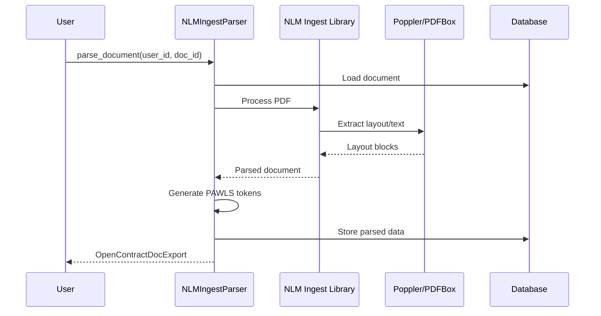

# NLM Ingest Parser

## Overview

The NLM Ingest Parser is an alternative PDF document parser that leverages the [NLM Ingest](https://github.com/nlmatics/nlm-ingestor) library for document processing. It provides robust PDF parsing capabilities with a focus on layout analysis and text extraction.

## Architecture



## Features

- **Layout Analysis**: Extracts document structure including headers, paragraphs, and tables
- **Text Extraction**: Reliable text extraction from PDF documents
- **PAWLS Compatibility**: Generates PAWLS-format token data for annotation
- **Metadata Extraction**: Extracts document metadata and properties
- **Page-level Processing**: Processes documents page by page for memory efficiency

## Configuration

The NLM Ingest Parser is configured through Django settings:

```python
# Configure the parser in settings
INSTALLED_PARSERS = [
    "opencontractserver.pipeline.parsers.nlm_ingest_parser.NLMIngestParser",
]

# Optional: Configure NLM Ingest settings
NLM_INGEST_CONFIG = {
    "parse_method": "auto",  # "auto", "pdfplumber", or "pypdf2"
    "extract_tables": True,
    "extract_images": False,
}
```

## Usage

Basic usage:

```python
from opencontractserver.pipeline.parsers.nlm_ingest_parser import NLMIngestParser

parser = NLMIngestParser()
result = parser.parse_document(user_id=1, doc_id=123)
```

With options:

```python
result = parser.parse_document(
    user_id=1,
    doc_id=123,
    extract_tables=True,  # Extract table structures
    parse_method="pdfplumber",  # Specify parsing backend
)
```

## Input

The parser expects:
- A PDF document stored in Django's storage system
- A valid user ID and document ID
- Optional configuration parameters

## Output

The parser returns an `OpenContractDocExport` dictionary containing:

```python
{
    "title": str,  # Document title if available
    "description": str,  # Generated description
    "content": str,  # Full text content
    "page_count": int,  # Number of pages
    "pawls_file_content": List[dict],  # PAWLS token data
    "labelled_text": List[dict],  # Structural annotations
    "doc_labels": List[dict],  # Document-level labels
}
```

### PAWLS Token Format

Each page in `pawls_file_content` contains:

```json
{
  "page": {
    "width": 612,
    "height": 792,
    "index": 0
  },
  "tokens": [
    {
      "text": "Example",
      "bbox": {
        "x": 100,
        "y": 100,
        "width": 50,
        "height": 12
      }
    }
  ]
}
```

## Processing Steps

1. **Document Loading**
   - Loads PDF from Django storage
   - Creates temporary file for processing

2. **NLM Ingest Processing**
   - Parses PDF using NLM Ingest library
   - Extracts text blocks and layout information
   - Identifies document structure

3. **Token Generation**
   - Converts text blocks to PAWLS tokens
   - Calculates bounding boxes
   - Preserves layout information

4. **Annotation Creation**
   - Creates structural annotations
   - Labels sections, headers, paragraphs
   - Preserves reading order

5. **Cleanup**
   - Removes temporary files
   - Returns parsed data

## Implementation Details

The parser extends the `BaseParser` class:

```python
class NLMIngestParser(BaseParser):
    title = "NLM Ingest Parser"
    description = "Parses PDF documents using NLM Ingest library"
    supported_file_types = [FileTypeEnum.PDF]

    def _parse_document_impl(
        self, user_id: int, doc_id: int, **kwargs
    ) -> Optional[OpenContractDocExport]:
        # Implementation using NLM Ingest
        pass
```

## Performance Considerations

- **Memory Usage**: Processes pages sequentially to minimize memory
- **Processing Time**: Typically 2-5 seconds per page
- **File Size**: Can handle large PDF files efficiently
- **Concurrent Processing**: Thread-safe for parallel processing

## Comparison with Docling Parser

| Feature | NLM Ingest | Docling |
|---------|------------|---------|
| Speed | Faster | Slower |
| Accuracy | Good | Excellent |
| OCR Support | Limited | Full |
| Table Extraction | Good | Excellent |
| Memory Usage | Lower | Higher |
| Dependencies | Simpler | Complex |

## Best Practices

1. **Parser Selection**
   - Use NLM Ingest for standard PDFs without OCR needs
   - Use Docling for complex layouts or scanned documents

2. **Configuration**
   - Start with default settings
   - Enable table extraction only when needed

3. **Error Handling**
   - Always check return values
   - Monitor logs for parsing errors

4. **Performance**
   - Process large batches asynchronously
   - Monitor memory usage

## Troubleshooting

### Common Issues

1. **Import Errors**
   ```
   ImportError: Cannot import nlm_ingestor
   ```
   - Install NLM Ingest: `pip install nlm-ingestor`
   - Check Python version compatibility

2. **Memory Issues**
   ```
   MemoryError during parsing
   ```
   - Reduce batch size
   - Increase available memory
   - Use page-by-page processing

3. **Layout Detection Failures**
   ```
   Warning: Could not detect layout
   ```
   - Try different parse_method settings
   - Check PDF structure/format
   - Consider using Docling parser

4. **Text Extraction Issues**
   ```
   Error: No text extracted
   ```
   - Check if PDF is scanned (needs OCR)
   - Verify PDF is not corrupted
   - Try force text extraction mode

## Dependencies

Required Python packages:
- `nlm-ingestor`: Core parsing library
- `pdfplumber`: PDF processing backend
- `pypdf2`: Alternative PDF backend
- `pillow`: Image processing support

## Limitations

- Limited OCR support (use Docling for OCR)
- May struggle with complex layouts
- Table extraction less sophisticated than Docling
- No support for non-PDF formats

## See Also

- [Pipeline Overview](pipeline_overview.md)
- [Docling Parser](docling_parser.md)
- [PDF Data Layer Architecture](../architecture/PDF-data-layer.md)
- [NLM Ingest Library](https://github.com/nlmatics/nlm-ingestor)
